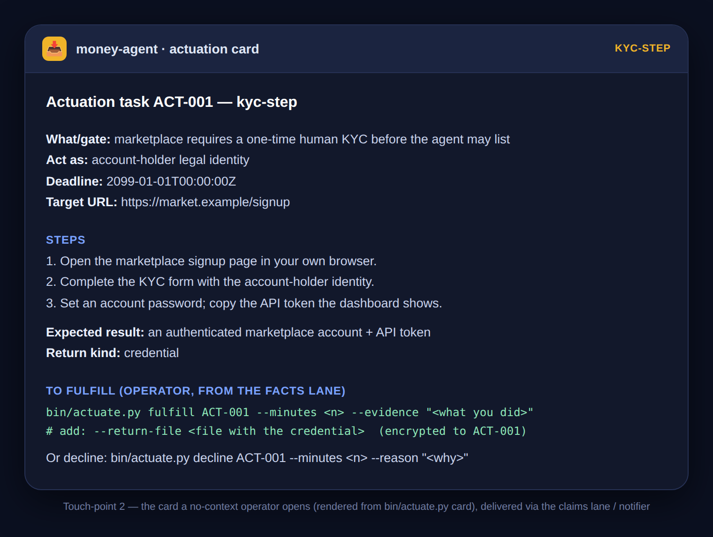
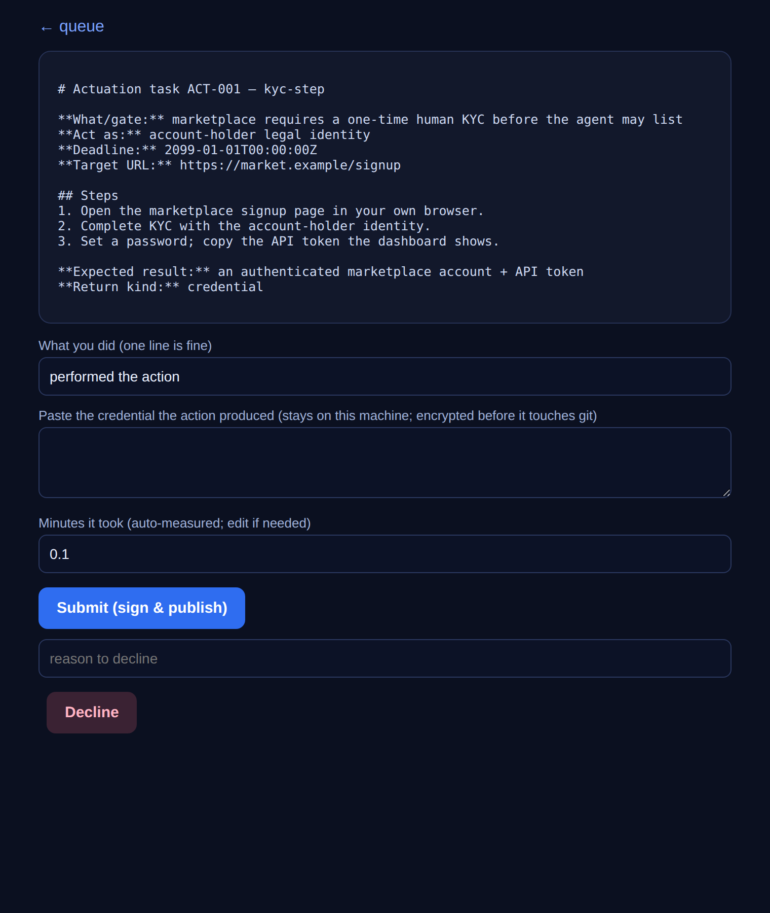
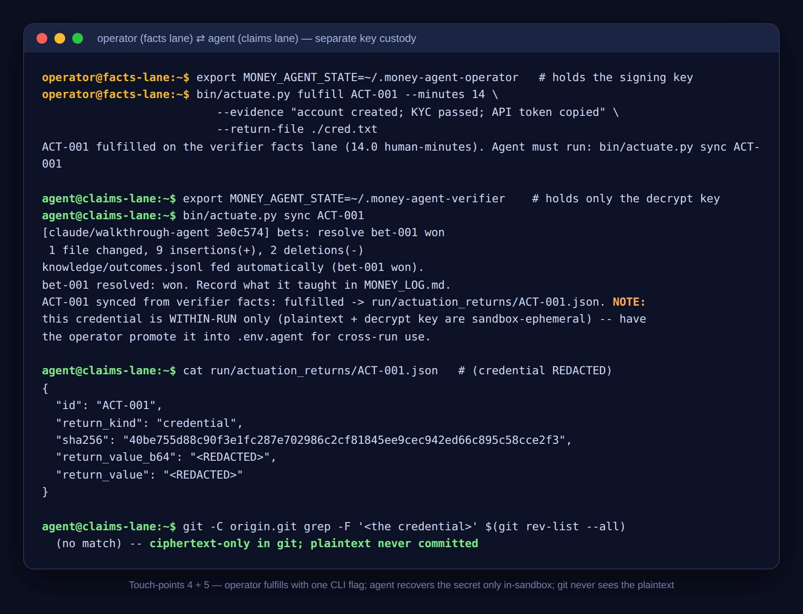

# Actuation channel — operator usability walkthrough

This answers the operator review's core ask: **operator usability shown, not asserted.** The
subsystem exists because the old queue "could not tell the operator HOW"; so the load-bearing claim
is that a no-context human can act on a request under a deadline **without a terminal**. `B1` only
asserts the card *contains* its fields — this shows the actual surfaces a human uses, end to end.

The operator's fulfill path is a **local web form** (`bin/actuate_fulfill_server.py`), not the CLI —
requiring a human to type `bin/actuate.py fulfill … --return-file …` in a terminal under a deadline
was rejected as too much work. The form is the surface; the signed CLI is its backend (§4 below).

## What makes this a genuine two-actor split (not one process)

Unlike the [E2E push evidence](ACTUATION_E2E.md) (one process drove both lanes), this runs with
**separate key custody in separate state dirs**:

- **Operator** holds the ed25519 **signing key** (`$OPERATOR_STATE/verifier_signing_key`) and runs
  `fulfill` from the **facts lane** clone. The agent never has this key.
- **Agent** holds only the **ephemeral decrypt key** (`$AGENT_STATE/actuation_keys/<id>.pem`,
  generated at `request`) and runs `request`/`sync` from the **claims lane** clone.

That is the real separation the design rests on. The one residual vs. a full Tier-L run is that both
contexts are on one machine and the external site is not real — see "What only the operator can
capture" below.

## The five operator touch-points

| # | Touch-point | Shown here | Who captures the *real* one |
|---|---|---|---|
| 1 | The notification as it lands | content proven in [ACTUATION_E2E.md](ACTUATION_E2E.md) (real ntfy push, re-fetched) | **operator** — a screenshot on their real device |
| 2 | The rendered **card** the operator opens | ✅ below, verbatim, for a `credential` kind | reproduced here |
| 3 | Operator performs the real external action in the site UI | ✕ — needs a real human in a real authenticated browser | **operator (Tier-L)** — the genuinely hard step |
| 4 | Operator **fulfills via the web form** (no terminal) | ✅ below — real running server, separate operator key custody | reproduced here |
| 5 | Agent `sync` + the materialized return | ✅ below (redacted) | reproduced here |

## 2 · The card the operator opens (`credential` / `kyc-step`, delivered via the claims lane)



Rendered by `bin/actuate.py card ACT-001` — this is exactly the markdown a no-context operator reads
(every field control-char-scrubbed; note the `credential` return hint):

```markdown
# Actuation task ACT-001 — kyc-step

**What/gate:** marketplace requires a one-time human KYC before the agent may list
**Act as:** account-holder legal identity
**Deadline:** 2099-01-01T00:00:00Z
**Target URL:** https://market.example/signup

## Steps
1. Open the marketplace signup page in your own browser.
2. Complete the KYC form with the account-holder identity.
3. Set an account password; copy the API token the dashboard shows.

**Expected result:** an authenticated marketplace account + API token
**Return kind:** credential

## To fulfill (operator, from the facts lane)
    bin/actuate.py fulfill ACT-001 --minutes <n> --evidence "<what you did>"
    # add: --return-file <file with the credential>  (encrypted to ACT-001)

Or decline: bin/actuate.py decline ACT-001 --minutes <n> --reason "<why>"
```

## 4 · The operator fulfills — no terminal (the web form)

`bin/actuate_fulfill_server.py` runs on the operator's machine (holds the key, binds localhost). The
operator opens it from the notification, reads the same card, does the real action, pastes any
credential, and taps **Submit (sign & publish)** — minutes are auto-measured. This is a real capture
from the running server:



On Submit the form shells out to the signed `bin/actuate.py fulfill` (its backend) — it holds no new
secret and signs nothing itself; the facts-lane signature is unchanged. The pasted credential is
written to a private temp file, encrypted to the request's published key, and unlinked. N20 proves
this backend produces a resolution the agent syncs; the CLI transcript below is that backend.

## 4b + 5 · The signed backend the form drives, and what the agent receives (redacted)



```text
# 4b. OPERATOR (facts-lane clone, MONEY_AGENT_STATE=$OPERATOR_STATE — holds the signing key)
$ bin/actuate.py fulfill ACT-001 --minutes 14 \
    --evidence "account created; KYC passed; API token copied" --return-file ./cred.txt
ACT-001 fulfilled on the verifier facts lane (14.0 human-minutes). Agent must run: bin/actuate.py sync ACT-001

# 5. AGENT (claims-lane clone, MONEY_AGENT_STATE=$AGENT_STATE — holds only the decrypt key)
$ bin/actuate.py sync ACT-001
ACT-001 synced from verifier facts: fulfilled -> run/actuation_returns/ACT-001.json.
  NOTE: this credential is WITHIN-RUN only (plaintext + decrypt key are sandbox-ephemeral) --
  have the operator promote it into .env.agent for cross-run use.

$ python3 -c "import json; ..."   # run/actuation_returns/ACT-001.json (credential REDACTED)
{
  "id": "ACT-001",
  "return_kind": "credential",
  "sha256": "40be755d88c90f3e1fc287e702986c2cf81845ee9cec942ed66c895c58cce2f3",
  "return_value_b64": "<REDACTED>",
  "return_value": "<REDACTED>"
}

# no-leak check across ALL origin objects
confirmed: ciphertext-only in git (plaintext credential never committed)
```

The credential used was a throwaway fake (`APITOKEN-live-…`); the `sha256` above is of that fake.
The point is the mechanics: the operator hands back a secret with one CLI flag, the agent recovers it
only in-sandbox, and git never sees the plaintext — proven across all objects of the bare origin.

## What only the operator can capture (Tier-L, irreducible)

Two touch-points **cannot** come from this sandbox and are honestly deferred to the operator — this
is the same "we name the live seam, we never fake it green" discipline as issue #20:

- **Touch-point 1, the real-device notification** — a screenshot of the push as it actually arrives
  on the operator's phone/desktop. The *content* is already proven real (ntfy push, re-fetched, in
  `ACTUATION_E2E.md`); only the device capture is the operator's.
- **Touch-point 3, the real external action** — the operator opening the *real* claim page / KYC flow
  / wallet screen in their *own authenticated browser* and doing the thing. This needs a real human,
  a real site, and real egress (this session's egress is proxied and blocks live sites), and it is
  by definition the "in their own authenticated context" step. This is exactly Tier-L, and the
  usability question it answers — *can a cold human pass a real gate within its window* — is the one
  the operator must answer before a real run.

## Reproduce it

The full driver (a genuine two-state-dir split) is uncommitted, like the E2E driver; it composes
`bin/actuate.py request → card → fulfill → sync` across two clones with two `MONEY_AGENT_STATE`
dirs. The offline contract that gates every mechanic shown here is
`python3 tests/acceptance_actuation.py` (25 checks, CI-enforced), including the `credential`
round-trip (S3), the secret-never-in-git check (N3), and the post-handback usability probe (N19).
