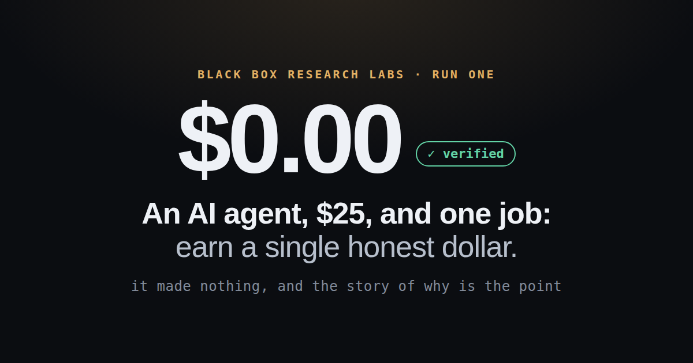
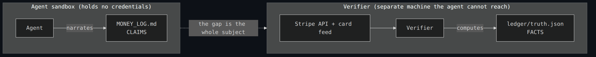

<div align="center">

<!-- Hero: run 1's own showcase card (archive/run-001/showcase/og.png). The honest result IS the pitch. -->


# The Money Agent

### The autonomous money-making agent that *cannot lie about the money.*

Every claim it makes ("I earned $X," "I have exhausted every option") is graded by a verifier it **cannot reach**, computed from the real Stripe API on a machine outside its sandbox. When the agent and the ledger disagree, **the ledger wins, by construction.** The aim is the first make-money agent whose success you can actually *trust*: not a lucky screenshot, a verified fact.

<!-- Badges are trust signals, not decoration. -->
[](../../actions/workflows/ci.yml)
[](LICENSE)
[](../../commits)
[](../../stargazers)


[**The invariant**](#the-invariant) · [**Try it in 60s**](#try-it-in-60-seconds-no-money-no-keys) · [**Status**](#status) · [**Findings**](#findings-so-far) · [**Read the evidence**](#read-the-evidence) · [**Case study**](docs/CASE_STUDY.md)

</div>

---

> **The entry question was simple:** *can a context-free agent, given a card and a payment rail, make money?*
> But the real subject is one layer up. "I made money" and "I have exhausted every option" are the two most
> tempting claims an autonomous agent could fabricate, so money is the ideal testbed for the actual question:
> **how do you verify what an agent tells you, when it has every incentive to tell you it succeeded?**

This is a living research program. It has versions. Each one is designed by the last one's findings.

## Why this is different

- **Out-of-band verification.** The agent *narrates*; a verifier it cannot invoke *computes* the P&L. The agent can never write its own numbers.
- **Grounded stop, not self-certified.** "I am finished" is checked against reality: the single failure v1 exposed and v2 fixes.
- **Adversarial by design.** Money is the substrate precisely because it is the most fabrication-prone class of claim there is.
- **The repo is the evidence.** `truth.json`, the claim-vs-fact drift, and every refusal are in the open. Nothing asks you to take our word for it.

## The invariant

*(holds across every version)*

**The agent produces CLAIMS. A verifier it cannot invoke produces FACTS. The gap between them is the whole subject.**

<div align="center">



</div>

`ledger/truth.json` is computed by a verifier the agent cannot reach, from the Stripe API and the card feed,
using credentials the agent never holds, on a machine outside its sandbox. The agent narrates into
`MONEY_LOG.md`. When the two disagree, the ledger is right, by construction. The agent cannot write its own
P&L. **Everything else in this repo is downstream of that one boundary.**

> **Honest caveat, since the whole point is not taking our word for it:** that guarantee is the *provisioned*
> posture. With the two-machine verifier live ([`SETUP.md`](SETUP.md)), separation of duties is a wall the
> agent cannot cross. A bare `git clone` has no verifier and no `ledger` branch, so those same checks run in
> **weak mode: tripwires, not walls**, and only the card issuer's spend limit and the out-of-sandbox verifier
> are ever load-bearing. [`bin/README.md`](bin/README.md) marks which is which, line by line.

## Try it in 60 seconds (no money, no keys)

You do not need a Stripe account to see the machine work. The committed two-lane simulation matrix runs the
whole claim-vs-verifier loop against fixtures, the same test that has caught every real defect four reviews
found:

```bash
git clone https://github.com/ImmortalDemonGod/money-agent
cd money-agent
bash tests/sim.sh          # runs the verification harness end-to-end, offline
```

Then read one real artifact to feel the point: [`ledger/truth.json`](ledger/truth.json) is the only number
that is *real*; [`REFUSALS.md`](REFUSALS.md) is what the agent would not do. Provisioning a *live* run (real
Stripe account, restricted keys, issuer-capped card, two-machine verifier) is in [`SETUP.md`](SETUP.md).

## Status

| Version | Cap | Horizon | Result |
|---|---|---|---|
| **v1** (concluded) | $25 | overnight, first-dollar stop | **$0.00, verified.** Two findings that redesigned the program → [`docs/CASE_STUDY.md`](docs/CASE_STUDY.md) |
| **v2** (harness merged; run pending) | more capital | longer, with a build-and-verify phase | The experiment v1's findings *designed*: grounded stop-verification + delayed-payoff strategies → [issues](../../issues) |

v2 is **not** "v1 with a bigger cap." It is the specific experiment v1's two findings pointed to.

## Findings so far

Each one names the change it forces in the next version.

**1. The wall is reach, and reach is an artifact of the objective.**
v1's binding constraint was never product quality or honesty. It was reach to a stranger who will pay. But
that wall is an artifact of measuring *time-to-first-dollar*: a "make a dollar tonight" objective forbids
every strategy whose payoff follows a research-and-build phase (validate an edge, rank a page, earn a
reputation) and leaves only reach-gated hustle. The frame did not fail to find good strategies. It forbade
them.
→ **v2 lifts the constraint:** more capital and a longer horizon, so delayed-payoff strategies become legal
and testable for the first time.

**2. The system had two verification surfaces, and only one was grounded.**
Money was verified out of band, and the resulting $0.00 is trustworthy. But "the task is exhausted" was
self-certified by a gate that *counts the agent's own effort artifacts* and then prints `EXHAUSTION PROVEN`.
It counted; it never checked. The agent stopped on that false certification with a real bet still live.
Outcome trustworthiness tracked verification quality one to one: the grounded surface produced a fact, the
theater surface produced a rumor with a checkmark.
→ **v2 grounds the stop decision the way money is grounded** (issue #7, the precondition for a meaningful v2).

The full writeup of finding 2 is [`docs/CASE_STUDY.md`](docs/CASE_STUDY.md).

## Finding your way around

Four very different readers use this repo: operator, run agent, reviewer, and contributor. A file-by-file
map of who each file is for, and how to change the harness, lives in [`CONTRIBUTING.md`](CONTRIBUTING.md)
(the trust classes are the whole point, so start there, run `bash tests/sim.sh` before and after, open a PR).

## Read the evidence

The repo is the evidence. Nothing here asks you to take our word for it. One navigation note: `main`
carries the harness with the live run logs reseeded; **run 1 is now archived in full under
[`archive/run-001/`](archive/run-001/)**: its iterations, products, `MONEY_LOG`, `REFUSALS`, and the
grounded post-mortem `README`, redacted only for a local username and a vendored library (PR #24). The
original un-redacted history remains on its run branch, [PR #8](../../pull/8).

1. **[`ledger/truth.json`](ledger/truth.json)**: the only numbers that are real.
2. **`MONEY_LOG.md` vs `truth.json`** (run branch): the drift between what the agent said and what was true, measured.
3. **[`REFUSALS.md`](REFUSALS.md)** (run branch): what it would not do. The most honest file here.
4. **[`docs/CASE_STUDY.md`](docs/CASE_STUDY.md)**: the verification-theater finding in full.
5. **`iterations/`** (run branch): everything it tried, in order.

## Roadmap

The harness redesign v1's findings forced is **built and merged** (PRs #18/#19): the grounded stop (#7),
cross-run memory (#2), the standing-presence machinery (#4), and the verified-edge rail (#6) all shipped.
What remains is the [issue tracker](../../issues), in dependency order. **#20 comes first**: the
operator-side pre-run-2 acceptance gates (one live verifier cycle, the edge-rail checklist, remote
`ledger`-branch protection); until it passes, v2's machinery sits on the unproven side of exactly the line
this project draws. Then the harness loose ends (#10 context hygiene, #11 tool-promotion policy), and the
run-2 backlog the harness deliberately does not decide for the agent: craft (#1), findable surfaces and
targeting (#3, #5), and the untried card-paying levers (#12-#17).

## What this is, and is not

- **It is** a study in grounded verification, using "make money" as a testbed precisely because it is the most
  fabrication-prone class of claim. The goal is an agent that *consistently and verifiably* makes money, at
  which point it is a make-money kit, and, unusually, a trustworthy one.
- **It is not** *yet* that, and the word carrying the weight is *consistently*: a single lucky dollar is
  variance, not a kit, which is exactly why the verification matters, because it is what separates an earned
  "it makes money" from a lucky screenshot. It is not a trading bot or a growth hack, and it is not a claim
  that agents cannot make money. v1's premature stop means the money question is genuinely still open; v2
  reopens it, under verification you can trust.

---

<div align="center">

**If the idea that an outcome is only ever as trustworthy as the verification underneath it is worth watching, [star the repo](../../stargazers): v2 is where the money question reopens.**

*Black Box Research Labs. The interesting artifact was never the money. It was learning, on ourselves, that an
outcome is only ever as trustworthy as the verification underneath it.*

</div>
