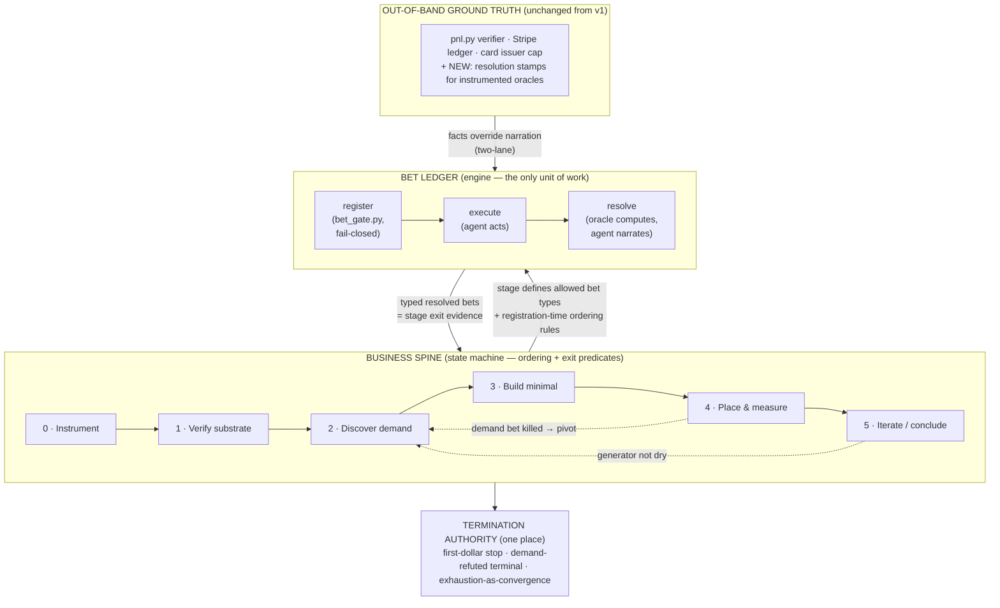

# V2 Harness Design: The Bet Ledger and the Business Spine

**Status:** Design proposal (not implemented). Derived from the v1 run evidence
(branch `claude/project-analysis-q4hjrg`, 88 logged iterations, verified $0.00) and from
the architecture of `aiv-workflow`'s `fix_pipeline.mjs` — the most stress-tested harness
available to this program (~130 regression-guarded learnings, selftest fixtures,
multi-model validation).

**One-sentence summary:** extend v1's verification architecture — which grounded exactly
one claim ("money arrived") outside the agent's reach — to every decision surface of the
run, by making the *bet* the only unit of work (engine) and a *business spine* the state
machine over bets (direction), with a single termination authority computed over the bet
ledger.

---

## 1. Problem statement: what v1 proved

v1's postmortem (`docs/CASE_STUDY.md`) reduces to one line: **outcome trustworthiness
tracked verification quality 1:1.** The money surface was grounded out-of-band and its
$0.00 is trustworthy. Every other decision surface was self-certified, and every one of
them failed at least once:

| # | v1 failure | Evidence (iterations) |
|---|-----------|----------------------|
| F1 | Premature "blocked/impossible" conclusions off n=1 | 002 ("distribution impossible" ~20 min in, withdrawn 003); "HN blocked" via curl 429, falsified by headed browser at 032 |
| F2 | Build-before-demand ordering inversion | Audit business built on research convergence, not a buyer (009); five-product portfolio shipped with agent noting "near-term traffic ~0" (044–056); first value-first human contact at 016; only inbound lead (026) left un-mined until 057 |
| F3 | Un-instrumented funnels → central conclusion undecidable | Host served `robots.txt: Disallow: /` all run, discovered at 070; reach telemetry at 087; traffic beacon built at 097 and never deployed; "reach is the wall" retracted at 098 because reach-wall vs conversion-wall could not be distinguished |
| F4 | Self-certified stop | `exhaustion_gate.py` (counts effort volume) exited 0 at 095; agent declared the run terminal and killed its own loop with the estate bet still pending; retracted at 096 |

Two structural findings sit under these:

1. **The inner loop was already sound.** Per-iteration, the agent ran
   hypothesis → probe → verdict → public correction, including pre-registered kill bars
   it honored against itself (front-page predictor: bar 2.5×, measured 2.20×, killed —
   073–074). The bet discipline exists behaviorally; it is not enforced mechanically.
2. **The outer loop lived in the operator.** Phase transitions map one-to-one onto
   operator interventions (→006, →009, →044, →052, →057, →087, →096, →098). Left alone,
   the agent's move at every phase boundary was "subtask exhausted, holding." The
   decomposition of the task was present the whole run — executed by a human, live.
   A control function a human performs systematically can be written down.

And one adjudicated lesson about enforcement layers, in the run's own words:

> "A behavioral rule that fails twice in always-injected context is not fixed by
> 'remember harder' — move enforcement into a gate." (iter 092)
>
> "Three exhortations and one gate, the exhortations all routed through the same
> interpreter... Redundancy that shares a single point of failure is not redundancy."
> (iter 096)

v2's PROMPT.md compiled the operator's corrections into **prose**. This document
compiles them into **mechanism**. Per PROMPT.md's own standard, this does not
contaminate the experiment: the harness stays blind to *the answer* (what to sell) while
becoming explicit about *the method* (how to search) — the line v2 already drew.

---

## 2. Design principles (imported from aiv-workflow, restated for this domain)

1. **Termination is the gate, not vibes.** Nothing — a channel, a stage, the run — is
   concluded because the agent feels done. It is concluded when a deterministic
   predicate over recorded evidence says so, or the harness HALTs.
2. **Two-lane / deterministic override.** Wherever a fact is mechanically checkable
   (traffic count, crawlability, reply-received, indexation, money), the harness or
   verifier computes it and **overrides the agent's self-report before any predicate
   evaluates**. The agent narrates; instruments testify.
3. **The ledger is the memory.** All run state that matters lives in committed files
   (the bet ledger), never in the conversation transcript. Compaction must be incapable
   of losing run state. (v1 partially had this: `ledger/truth.json`. v2 extends it to
   process state.)
4. **Fail-closed.** A gate that cannot verify, refuses. A broken gate must never
   rubber-stamp either success or defeat (v1's `exhaustion_gate.py` already got this
   half-right — it failed closed, it just measured the wrong quantity).
5. **Harness owns ceremony.** Registration files, schema checks, ordering rules,
   convergence math are computed, never entrusted to the model's discipline. The model
   is left only the irreducible semantic acts: generating bets and judging EV.
6. **The out-of-band anchor is sacred and unchanged.** The Stripe verifier
   (`bin/pnl.py`), the out-of-tree baseline, the wash-trade guard, SoD git authorship,
   and the first-dollar stop are v1's crown jewels. Nothing here weakens them; the
   design extends the same shape to more surfaces.
7. **Compile corrections into guards.** v1's operator-correction changelog
   (PROMPT.md v2 §Changelog) is this program's equivalent of `fix_pipeline.mjs`'s `#NN`
   numbered learnings. The standing rule: any correction issued twice becomes a
   mechanical guard, not another paragraph.

---

## 3. Architecture overview

Two levels, one machine — the same structure as `fix_pipeline.mjs`, where `driveSpine`
does no work itself (it fixes ordering and decides doneness) and the goal-loop stages do
all the work (fresh attempts iterated until a deterministic gate goes green).



**Why neither level is redundant** (each proven by v1):

- *Bets without a spine is v1 itself:* rigorous falsification executed in the wrong
  order — five honestly-verified products on a host never verified crawlable, before
  demand was probed, with measurement last. Bet discipline is orthogonal to direction.
- *A spine without bets relocates self-certification:* "demand validated" is not
  directly computable; without a falsifiable unit of work inside each stage, stage exits
  regress to the agent vibing "I think this stage is done" — verification theater one
  level down.

The joint: **spine exit criteria are written in the bet vocabulary** ("stage 2 exits
when ≥1 bet of type `demand-confirmed` resolves CONFIRMED"), and **spine ordering is
enforced at bet-registration time** ("no `build`-type bet registers while zero
`demand`-type bets are confirmed").

---

## 4. The bet layer (the engine)

### 4.1 Bet lifecycle

```
DRAFT → REGISTERED → ACTIVE → RESOLVED { CONFIRMED | KILLED | EXPIRED | INCONCLUSIVE }
```

- **EXPIRED** and **INCONCLUSIVE** are first-class verdicts, not failures to have a
  verdict. Money-domain oracles are slow (indexing: days) and noisy (a non-reply is weak
  evidence). This mirrors `finding_verdict` in aiv-workflow admitting `inconclusive`,
  and REFUTED being a *successful* terminal.
- A KILLED demand bet is a **result** (the audit gets a finding; the spine may pivot),
  exactly like aiv-workflow exit code 5.

### 4.2 The bet-spec (schema)

One file per bet: `bets/BET_<NNN>.json`. This is the money-domain analog of
aiv-workflow's finding-spec — the creative act compressed into a falsifiable contract,
after which machinery takes over.

```json
{
  "id": "BET_014",
  "stage": 2,
  "type": "demand-confirmed",
  "claim": "Show HN founders with structured-data errors will pay $5 for a validated fix",
  "success_condition": {
    "metric": "reply_with_purchase_intent",
    "source": "mail.py inbox (verifier-stamped) OR stripe payment (pnl.py)",
    "threshold": ">= 1 within window"
  },
  "kill_condition": {
    "metric": "sends_without_reply",
    "source": "SENT_LOG.md (harness-counted) + beacon open-tracking",
    "threshold": ">= 15 value-first sends, 0 replies, window elapsed"
  },
  "deadline_utc": "2026-07-20T00:00:00Z",
  "oracle": "instrumented",
  "prereq_artifacts": ["beacon deployed", "mail round-trip verified"],
  "ev_note": "free text — the agent's judgment, recorded but never gated",
  "max_spend_usd": 0
}
```

Schema rules (validated by the gate, fail-closed):

- `success_condition.source` must name an **instrument or verifier surface that
  exists** — a success condition citing an uninstrumented surface refuses to register.
  This single rule makes v1's F3 structurally impossible: the iter-022 funnel could not
  have been bet on, because "conversion" had no measurable source until the beacon
  existed. It forces Instrument to be stage 0 without ever saying so.
- `deadline_utc` required. No open-ended bets; "pending forever" was the estate-bet
  ambiguity that made iter 095 arguable.
- `type` must be legal for the current spine stage (see §5.2).
- `max_spend_usd` — per-bet spend authorization; the card cap remains the hard wall.

### 4.3 Registration gate — `bin/bet_gate.py` (new, fail-closed)

Runs at registration and again pre-action. Refuses when:

1. The bet-spec fails schema (missing oracle source, no deadline, unmeasurable success).
2. **Ordering rules are violated** (§5.2) — the spine's teeth.
3. The bet is a **block-claim** (`type: channel-blocked`) without a specified
   reproduction protocol — n=1 claims must state, up front, the falsification attempts
   that will be run before the verdict records (headed browser, second account, second
   vector). This mechanizes v1's strongest habit (the 032–043 falsification campaign)
   and blocks its worst one (F1).
4. Any *action with external effect* (send, publish, deploy, spend) has no ACTIVE bet
   whose spec covers it — enforced by wiring `bet_gate.py` into `mail.py` and the
   publish tools the same way `disclosure_gate.py` already is (fail-closed, proven
   pattern from iter 092–093).

### 4.4 Resolution — two-lane, always

| Oracle class | Who computes the fact | Examples |
|---|---|---|
| `deterministic` | Harness, at resolution time | `curl robots.txt`; payment-link HTTP 200; mail round-trip; DNS |
| `instrumented` | Beacon / mail verifier, stamped out-of-band | traffic arrived, human vs bot, reply received, page indexed |
| `stripe` | `pnl.py` (unchanged) | money arrived (first-dollar stop) |
| `judgment` | **Not allowed as a success oracle.** | A bet whose success only the agent can assess does not register. |

The agent writes a narrative resolution; the harness/verifier writes the **fact stamp**
(`bets/resolutions/BET_<NNN>.json`, verifier-committed for instrumented/stripe classes,
protected by extending `sod_hook.sh`). Where they disagree, the stamp wins — same rule,
same words, as `ledger/truth.json`. The agent cannot mark its own bet CONFIRMED on any
instrumented oracle, for the same reason it cannot write its own P&L.

---

## 5. The spine layer (the state machine)

### 5.1 Stage table

Derived by inverting v1's observed deviations; each stage cites the run evidence that
motivates it.

| # | Stage | Purpose | Allowed bet types | Exit predicate (typed resolved bets) | v1 evidence |
|---|-------|---------|-------------------|--------------------------------------|-------------|
| 0 | **Instrument** | Make everything downstream measurable | `instrument-live` | beacon + mail-tracking + funnel events each CONFIRMED (deterministic self-tests) | Beacon built at 097, never deployed — "the instrument the run needed from hour one." F3. |
| 1 | **Verify substrate** | The serving/delivery layer works | `substrate` | crawlable, deliverable, payable each CONFIRMED — **fully deterministic** (`curl robots.txt`, mail round-trip, link resolves) | surge.sh `Disallow: /` discovered at 070 after 69 iterations of invisible shipping. |
| 2 | **Discover demand** | A validated pain in a *reachable, card-paying* audience | `demand-confirmed`, `channel-open`, `channel-blocked` | ≥1 `demand-confirmed` CONFIRMED **and** ≥1 `channel-open` CONFIRMED for the same audience | First human contact at 016; Marcos inbound (026) un-mined until 057; zero-reply campaign 062–068. F2. |
| 3 | **Build minimal** | One rail + one product matched to the confirmed pain | `delivery` | `delivery` CONFIRMED (deterministic: product delivered end-to-end to a test path) | Iter 001 was right (rail in ~1h); the 044–056 portfolio was premature. |
| 4 | **Place & measure** | Put the offer in the validated channel; measure the funnel | `funnel` | `funnel` bet RESOLVED either way — measured traffic **and** measured conversion, so reach-wall vs conversion-wall is decidable | The undecidability retraction at 098. |
| 5 | **Iterate / conclude** | Pivot on evidence or terminate | any (re-entry) | Termination authority only (§6) | The false stop at 095/096. F4. |

Stage 0 and 1 exits are **entirely deterministic** — no AI judgment, no oracle latency.
That some business-spine gates are exactly as mechanical as CI is the strongest
counter to "business can't be staged": the single most expensive bug of v1 (F3's
robots.txt) is caught by a `curl`.

### 5.2 Ordering rules (enforced at registration, not by exhortation)

```
demand-confirmed   requires  stage >= 2  (instrument + substrate exited)
delivery (build)   requires  >= 1 demand-confirmed CONFIRMED
funnel             requires  delivery CONFIRMED  AND  channel-open CONFIRMED
channel-blocked    requires  reproduction protocol in spec (see §4.3.3)
```

This is `driveSpine` refusing to run write-code before the plan converges. It is the
rule that blocks F2 at the moment of temptation rather than in a retro.

### 5.3 Re-entry and the pivot loop

Stage 4 resolving a `funnel` bet as KILLED-for-demand-reasons re-enters stage 2 with the
finding recorded (the pivot). Guards, both borrowed from `backHalfConverge`:

- **Pivot cap** (`PIVOT_CAP`, default 3): more pivots than that in one run HALTs for
  operator review rather than wandering.
- **Oscillation detector**: two consecutive pivots landing on the same
  (audience, pain) signature HALT — the loop is cycling, not converging.

### 5.4 Spine config — `spine.yml`

The stage table, allowed types, exit predicates, ordering rules, caps, and windows live
in one committed config file — the analog of `LIVE_STAGES` + `GATE_FN`. The spine is
deliberately cheap: **a stage is a phase label on bets plus predicates over the
ledger.** No new state machine process; `bin/spine.py` evaluates predicates over
`bets/` on demand and prints the current stage, open obligations, and what exit
requires. It is consulted by `bet_gate.py` (ordering) and by the termination authority.

---

## 6. Termination — one authority

v1's false stop happened because termination had two authorities (the agent's judgment
plus a volume-counting permission gate) and neither owned it. v2 gives it one place —
`bin/conclude_gate.py`, computed entirely over the bet ledger — with three terminals:

1. **FIRST DOLLAR** (unchanged, `guard.py`, verifier-grounded): `received_usd > 0` →
   halt, retro, operator review. Still the run's answer.
2. **DEMAND REFUTED** (new, the exit-code-5 analog — a *successful* terminal): every
   registered `demand` bet across ≥ K distinct (audience, pain) pairs resolved KILLED,
   pivot cap reached. The run's answer is "no demand reachable in-bounds," and it is
   *evidenced*, not asserted.
3. **EXHAUSTION AS CONVERGENCE** (replaces `exhaustion_gate.py`'s volume counting):

```python
def exhausted() -> bool:
    return (
        all(bet.resolved for bet in ledger)            # nothing pending — kills the
                                                       #   iter-095 case by construction
        and no_unexpired_deadlines(ledger)             # no oracle still on the clock
        and generator_dry_rounds >= K                  # last K generation rounds produced
                                                       #   zero registrable novel bets
                                                       #   (novelty = new (type, audience,
                                                       #   channel) signature, harness-
                                                       #   computed, not self-graded)
    )
```

   "A full round changes nothing, stable K rounds" — `backHalfConverge`'s stable
   predicate, transplanted. Iteration 095 becomes mechanically impossible: the estate
   bet was registered, unexpired, unresolved, so `exhausted()` is false regardless of
   how the agent feels or how many artifacts exist.

The agent may still *want* to stop; it may not *record* a terminal conclusion unless the
authority's predicate holds — and unlike v1, the predicate measures the ledger's state,
never the agent's effort volume.

---

## 7. Instrumentation (stage 0 spec)

The minimum instrument set that makes the rest of the design computable:

| Instrument | Exists? | Gap to close |
|---|---|---|
| Traffic beacon (referrer/UA/ASN, salted IP hash, bot-vs-human classifier, `/go` click-through) | Built at iter 097 (`iterations/097/`), never deployed | Deploy at run start; verifier reads its store out-of-band and stamps `funnel`/`traffic` resolutions |
| Mail truth (send log, reply detection) | `mail.py` + `SENT_LOG.md` exist; reply detection is manual inbox reading | Harness-side reply matcher keyed to bet id; stamp `reply_received` resolutions |
| Funnel events (view → click → checkout-open → paid) | Only the `paid` end exists (`pnl.py`) | Beacon events for the first three; `paid` stays Stripe-grounded |
| Substrate probes (crawlable/deliverable/payable) | Ad-hoc in v1 | `bin/substrate_probe.py`, deterministic, run at stage 1 and re-run before any `funnel` bet resolution |

Standing rule (§4.2): **no bet registers whose success condition cites a surface not on
this list as CONFIRMED live.** Instrumentation is not a stage the agent may skip; it is
the precondition of the vocabulary.

---

## 8. Enforcement layers — who can defeat what

Honest accounting, in v1's own style ("only the issuer and the out-of-sandbox verifier
are walls; the rest are tripwires"):

| Layer | Mechanism | Agent can defeat? |
|---|---|---|
| **Walls** (out of sandbox) | Card issuer cap · `pnl.py` + read key · baseline/constitution hash in `~/.money-agent-verifier` · **NEW:** verifier-stamped bet resolutions for instrumented/stripe oracles · beacon datastore read out-of-band | No |
| **Tripwires** (in sandbox, deterministic, fail-closed) | `bet_gate.py` registration + ordering · `spine.py` predicates · `conclude_gate.py` convergence · `substrate_probe.py` · extended `sod_hook.sh` over `bets/resolutions/` · `guard.py` (unchanged) | In principle (it can edit files it sees) — but every edit is visible in git authorship, and the SoD tripwire + verifier catch the surfaces that matter |
| **Prose** (judgment, ungated by design) | Bet generation quality · EV notes · which bet to run next within a stage | N/A — deliberately the agent's |

The design's discipline: **nothing moves from the prose row to a claim in the record
without passing through a tripwire, and nothing in the record resolves without a wall or
a deterministic probe.** That sentence is the whole document.

---

## 9. Concept mapping to aiv-workflow

| aiv-workflow | This design | Notes |
|---|---|---|
| finding-spec (`goalCondition` required as input) | bet-spec (oracle + deadline required to register) | The creative act compressed into a falsifiable contract |
| `driveSpine` (ordering + doneness, does no work) | `spine.yml` + `spine.py` | Stage = phase label + predicates over the ledger |
| goal-loop stage iterating until `verifyCmd` green | stage iterating bets until typed exit bet CONFIRMED | Bet = the iteration unit |
| `GATE_FN` pure predicates | resolution predicates + `conclude_gate.py` | Fed only harness/verifier-computed facts |
| Two-lane deterministic override (`crActionableCount`) | instrument stamps override narration | Identical principle, new instruments |
| `state.json` resume cursor / "git state is memory" | `bets/` ledger, committed | Compaction-proof by construction |
| Exit code 5 REFUTED (successful terminal) | DEMAND REFUTED terminal | A killed hypothesis is a result |
| `backHalfConverge` stable-N + oscillation HALT | `exhausted()` + pivot oscillation detector | Termination as convergence |
| `#NN` numbered learnings compiled into guards | operator-correction changelog compiled into gates | v1 compiled them into prose; that was the bug |
| H1 (human picks the finding) | agent generates bets (ungated); operator reviews at terminals | The honest residual, unchanged in kind |

## 10. Failure-mode traceability

| v1 failure | Caught by | Level |
|---|---|---|
| F1 premature "blocked" | block-claim reproduction protocol required at registration (§4.3.3) | Bet |
| F2 build-before-demand | ordering rules at registration (§5.2) | Spine |
| F3 unmeasurable funnels | stage 0/1 exits + "no uninstrumented success condition" (§4.2, §7) | Both |
| F4 self-certified stop | single termination authority over the ledger (§6) | Spine |
| (092) disclosure-rule failures | already solved by `disclosure_gate.py`; `bet_gate.py` reuses the same fail-closed wiring pattern | Bet |

Nothing needs both levels to catch it and nothing falls between them — the sign the
two-level cut is at the right joint.

---

## 11. What this design does NOT solve (honest residuals)

1. **Bet generation quality.** No gate can score whether "try Japanese dev platforms"
   was a *smart* next bet, only whether it was falsifiable, instrumented, legal for the
   stage, and accounted for. aiv-workflow's answer to the same gap is a human (H1).
   Here the generator stays autonomous and ungated; only its outputs are disciplined.
   Anyone claiming to have gated hypothesis quality has rebuilt `exhaustion_gate.py`.
2. **The EV call on the marginal bet.** When to stop probing a channel that keeps
   returning INCONCLUSIVE is judgment. Caps and no-progress detectors *bound* it; they
   do not *make* it.
3. **Oracle latency vs run horizon.** Indexing resolves in days; replies in days. The
   run's clock must exceed the slowest registered oracle's window, or deadlines will
   mass-expire and DEMAND-REFUTED fires spuriously. This is a run *parameter* (v1's
   "make a dollar tonight" horizon was the deepest forcing function of F2), not a
   harness feature. Set the horizon after the oracle windows, not before.
4. **Operator role change.** From phase clock (v1, unsustainable, and the thing this
   design mechanizes) to evidence judge at terminals (H2-style): reviews the ledger at
   FIRST-DOLLAR / DEMAND-REFUTED / EXHAUSTION / HALT, and only there.

---

## 12. Implementation plan

Ordered so each phase is independently valuable and testable; the bet layer comes first
because it is enforceable standing alone, and the spine is constraints over it (the
reverse order has nothing to gate).

**Phase 1 — Bet ledger + gates** (`bets/` schema, `bin/bet_gate.py`, `mail.py`/publish
wiring, `sod_hook.sh` extension). *Acceptance:* an unregistered send is blocked; a bet
with an unmeasurable success condition refuses to register; a block-claim without a
reproduction protocol refuses; all proven by `setup_sandbox.sh`-style negative tests
(attempt the forbidden thing, verify it failed — the v1 pattern of proving guards fire).

**Phase 2 — Instrumentation** (deploy the 097 beacon; reply matcher;
`substrate_probe.py`; verifier stamps resolutions). *Acceptance:* a synthetic visit
produces a stamped `traffic` resolution the agent cannot author; substrate probes catch
a deliberately-planted `Disallow: /`.

**Phase 3 — Spine + termination** (`spine.yml`, `bin/spine.py`, `bin/conclude_gate.py`;
retire `exhaustion_gate.py`). *Acceptance:* a `build` bet refuses to register with zero
confirmed demand bets; `exhausted()` is false while any unexpired bet is open (the
iter-095 replay test — this exact scenario becomes the regression fixture); pivot
oscillation HALTs.

**Phase 4 — Wire into the loop** (`guard.py` preflight calls `spine.py` status;
PROMPT.md v3 shrinks — the how-you-work prose that became mechanism is deleted, per the
v1 rule that ceremony can live in files but bounds must be mechanical; CLAUDE.md mirrors
the new gate list). *Acceptance:* a full dry run from a clean clone walks stages 0→2 on
synthetic instruments without operator input.

Estimated scale: comparable to the existing `bin/` (~1.5–2k lines of Python + one YAML),
no new services beyond the already-built beacon. Every gate ships with its negative
test, and every guard cites the v1 iteration that motivated it — the `#NN` discipline,
adopted from day one.

---

## 13. Open questions

1. **Where do bet-resolution stamps commit?** Options: the verifier loop co-commits
   them with `truth.json` (one authority, more coupling) vs a second stamp file the
   verifier signs (looser, two commit paths). Leaning: co-commit — one verifier, one
   commit identity, one SoD rule.
2. **Novelty signature for `generator_dry`.** `(type, audience, channel)` is proposed;
   too coarse and the gate calls novel bets duplicates, too fine and re-skins evade it.
   Needs one calibration pass against the v1 log (the 88 iterations are a labeled
   dataset of novel-vs-rehashed moves).
3. **Should INCONCLUSIVE count toward DEMAND-REFUTED?** Proposed: no — only KILLED
   counts; INCONCLUSIVE re-registers with a tightened oracle or expires. Mirrors
   `finding_verdict`'s strict-mode toggle.
4. **Horizon parameter.** Who sets the run clock relative to oracle windows — config
   (`spine.yml: max_oracle_window`) refusing bets whose deadline exceeds the run's end?
   Probably yes: a bet that cannot resolve inside the run should not register.
