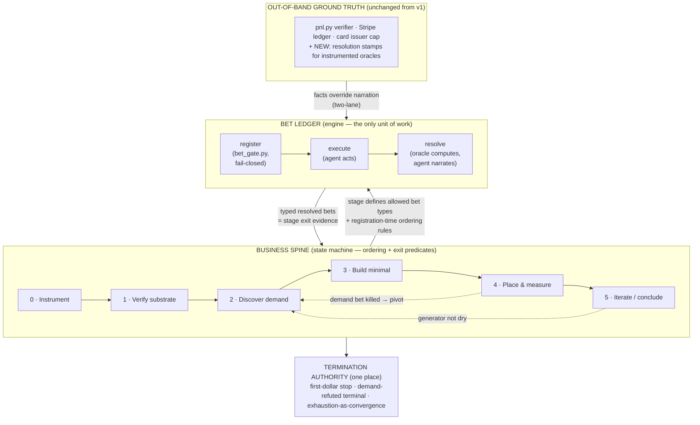

# V2 Harness Design: The Bet Ledger and the Business Spine

**Status:** Design proposal, with a correction to its own provenance. This document was
DRAFTED against pre-v2 main (`5cc4adc`) — i.e., blind to the v2 harness that had already
merged (PR #18 "v2 harness redesign", PR #19 "verified-edge rail + standing presence",
main @ `3910122`). §0 reconciles the proposal against what is actually implemented; §14
re-runs the stress tests against the real code with file:line evidence. Derived from the
v1 run evidence (branch `claude/project-analysis-q4hjrg`, 88 logged iterations, verified
$0.00) and from the architecture of `aiv-workflow`'s `fix_pipeline.mjs`.

---

## 0. Reconciliation with the implemented v2 (main @ `3910122`)

Much of this proposal already exists in v2, sometimes in a stronger form, sometimes
deliberately narrower. Honest accounting:

| This doc proposed | v2 implemented | Status |
|---|---|---|
| Bet ledger with deadlines; open bets block "impossible" (§4, §6) | `bin/bets.py`: committed registry for **day-scale external-clock** bets (clock class, poll cadence, `RESOLVE_BY` must be future, evidence-required resolution); `guard.py:296-308` prints the due-bets agenda every iteration; `conclusion_gate.py:216-231` blocks conclusions over any open bet | **Implemented, narrower scope** — registry covers external clocks and catches *forgetting* (declared: tripwire, not wall, `bets.py:17-19`); it does not gate actions and resolutions are self-certified text |
| Exhaustion as convergence; single termination authority; iter-095 impossible (§6) | `bin/conclusion_gate.py`: effort floor + filled packet + **fresh-context adversary** (hash-pinned to MONEY_LOG + a ≥30-line transcript) + no-live-bets; and the deeper fix — **a passing gate never stops the run**; no stop condition may read it | **Implemented, different mechanism** — v2 uses an adversarial-search novelty check where this doc used a novelty signature; v2's decoupling of permission-to-record from stop semantics is *stronger* than what this doc specified |
| Instrument-first; no unmeasurable success conditions (§7) | Beacon promoted to canonical harness (`harness/beacon/`, entry 007); `bin/host_check.py` (serving-layer gate, SSRF-guarded, `HOST_CHECK` line required by `aiv_gate.sh` for publish claims) | **Implemented** at the artifact level; NOT implemented as a registration-time refusal of unmeasurable bets |
| Out-of-rail check for e.g. trading (§14.1-A1 as first drafted) | **The verified-edge rail** (`bin/edge.py`, `bin/edge_pnl.py`, `ledger/edge.json`): trading is not refused — it is *scored*, as rail #2 | **This doc's first-draft verdict was wrong**; see §14.1 rewritten |
| Verifier-stamped bet resolutions (§4.4) | Not implemented — `bets.py resolve` requires evidence text but the agent authors it | **Still additive** (v2 consciously scoped the registry to the forgetting failure-mode, not forging) |
| Business spine / demand-before-build ordering (§5) | Not implemented — v2 keeps the harness strategy-free by design (context discipline: `knowledge/` is "operational, never strategic") | **Still additive, and now carries a named tension**: is ordering enforcement *method* (allowed by PROMPT v2's own method-vs-answer line) or *strategy injection* (which v2 deliberately refuses)? Operator call. |
| Instant-delivery test (§14.3-A4) | Not implemented — deliver-in-full remains constitution prose; containment is the first-dollar stop | **Still additive**, see §14.3 |
| `bounds_note` per bet (§14.2-A2) | Not implemented (nearest precedent: `disclosure_gate.py`, now canonical on main and wired into `mail.py`) | **Still additive** |

**One-sentence summary:** extend v1's verification architecture — which grounded exactly
one claim ("money arrived") outside the agent's reach — to every decision surface of the
run, by making the *bet* the only unit of work (engine) and a *business spine* the state
machine over bets (direction), with a single termination authority computed over the bet
ledger.

**Companion analysis:** `docs/COMPARATIVE_ANALYSIS.md` places this design in the landscape of every known public attempt at the same problem; §18 below maps its findings onto this design's primitives.

---

## 1. Problem statement: what v1 proved

v1's postmortem (`docs/CASE_STUDY.md`) reduces to one line: **outcome trustworthiness
tracked verification quality 1:1.** The money surface was grounded out-of-band and its
$0.00 is trustworthy. Every other decision surface was self-certified, and every one of
them failed at least once:

| # | v1 failure | Evidence (iterations) |
|---|-----------|----------------------|
| F1 | Premature "blocked/impossible" conclusions off n=1 | 002 ("distribution impossible" ~20 min in, withdrawn 003); "HN blocked" via curl 429, falsified by headed browser at 032 |
| F2 | Build-before-demand ordering inversion | Audit business built on research convergence, not a buyer (009); five-product portfolio shipped with agent noting "near-term traffic ~0" (044–056); first value-first human contact at 016; only inbound lead (026) left un-mined until 057 |
| F3 | Un-instrumented funnels → central conclusion undecidable | Host served `robots.txt: Disallow: /` all run, discovered at 070; reach telemetry at 087; traffic beacon built at 097 and never deployed; "reach is the wall" retracted at 098 because reach-wall vs conversion-wall could not be distinguished |
| F4 | Self-certified stop | `exhaustion_gate.py` (counts effort volume) exited 0 at 095; agent declared the run terminal and killed its own loop with the estate bet still pending; retracted at 096 |

Two structural findings sit under these:

1. **The inner loop was already sound.** Per-iteration, the agent ran
   hypothesis → probe → verdict → public correction, including pre-registered kill bars
   it honored against itself (front-page predictor: bar 2.5×, measured 2.20×, killed —
   073–074). The bet discipline exists behaviorally; it is not enforced mechanically.
2. **The outer loop lived in the operator.** Phase transitions map one-to-one onto
   operator interventions (→006, →009, →044, →052, →057, →087, →096, →098). Left alone,
   the agent's move at every phase boundary was "subtask exhausted, holding." The
   decomposition of the task was present the whole run — executed by a human, live.
   A control function a human performs systematically can be written down.

And one adjudicated lesson about enforcement layers, in the run's own words:

> "A behavioral rule that fails twice in always-injected context is not fixed by
> 'remember harder' — move enforcement into a gate." (iter 092)
>
> "Three exhortations and one gate, the exhortations all routed through the same
> interpreter... Redundancy that shares a single point of failure is not redundancy."
> (iter 096)

v2's PROMPT.md compiled the operator's corrections into **prose**. This document
compiles them into **mechanism**. Per PROMPT.md's own standard, this does not
contaminate the experiment: the harness stays blind to *the answer* (what to sell) while
becoming explicit about *the method* (how to search) — the line v2 already drew.

---

## 2. Design principles (imported from aiv-workflow, restated for this domain)

1. **Termination is the gate, not vibes.** Nothing — a channel, a stage, the run — is
   concluded because the agent feels done. It is concluded when a deterministic
   predicate over recorded evidence says so, or the harness HALTs.
2. **Two-lane / deterministic override.** Wherever a fact is mechanically checkable
   (traffic count, crawlability, reply-received, indexation, money), the harness or
   verifier computes it and **overrides the agent's self-report before any predicate
   evaluates**. The agent narrates; instruments testify.
3. **The ledger is the memory.** All run state that matters lives in committed files
   (the bet ledger), never in the conversation transcript. Compaction must be incapable
   of losing run state. (v1 partially had this: `ledger/truth.json`. v2 extends it to
   process state.)
4. **Fail-closed.** A gate that cannot verify, refuses. A broken gate must never
   rubber-stamp either success or defeat (v1's `exhaustion_gate.py` already got this
   half-right — it failed closed, it just measured the wrong quantity).
5. **Harness owns ceremony.** Registration files, schema checks, ordering rules,
   convergence math are computed, never entrusted to the model's discipline. The model
   is left only the irreducible semantic acts: generating bets and judging EV.
6. **The out-of-band anchor is sacred and unchanged.** The Stripe verifier
   (`bin/pnl.py`), the out-of-tree baseline, the wash-trade guard, SoD git authorship,
   and the first-dollar stop are v1's crown jewels. Nothing here weakens them; the
   design extends the same shape to more surfaces.
7. **Compile corrections into guards.** v1's operator-correction changelog
   (PROMPT.md v2 §Changelog) is this program's equivalent of `fix_pipeline.mjs`'s `#NN`
   numbered learnings. The standing rule: any correction issued twice becomes a
   mechanical guard, not another paragraph.

---

## 3. Architecture overview

Two levels, one machine — the same structure as `fix_pipeline.mjs`, where `driveSpine`
does no work itself (it fixes ordering and decides doneness) and the goal-loop stages do
all the work (fresh attempts iterated until a deterministic gate goes green).



**Why neither level is redundant** (each proven by v1):

- *Bets without a spine is v1 itself:* rigorous falsification executed in the wrong
  order — five honestly-verified products on a host never verified crawlable, before
  demand was probed, with measurement last. Bet discipline is orthogonal to direction.
- *A spine without bets relocates self-certification:* "demand validated" is not
  directly computable; without a falsifiable unit of work inside each stage, stage exits
  regress to the agent vibing "I think this stage is done" — verification theater one
  level down.

The joint: **spine exit criteria are written in the bet vocabulary** ("stage 2 exits
when ≥1 bet of type `demand-confirmed` resolves CONFIRMED"), and **spine ordering is
enforced at bet-registration time** ("no `build`-type bet registers while zero
`demand`-type bets are confirmed").

---

## 4. The bet layer (the engine)

### 4.1 Bet lifecycle

```text
DRAFT → REGISTERED → ACTIVE → RESOLVED { CONFIRMED | KILLED | EXPIRED | INCONCLUSIVE }
```

- **EXPIRED** and **INCONCLUSIVE** are first-class verdicts, not failures to have a
  verdict. Money-domain oracles are slow (indexing: days) and noisy (a non-reply is weak
  evidence). This mirrors `finding_verdict` in aiv-workflow admitting `inconclusive`,
  and REFUTED being a *successful* terminal.
- A KILLED demand bet is a **result** (the audit gets a finding; the spine may pivot),
  exactly like aiv-workflow exit code 5.

### 4.2 The bet-spec (schema)

One file per bet: `bets/BET_<NNN>.json`. This is the money-domain analog of
aiv-workflow's finding-spec — the creative act compressed into a falsifiable contract,
after which machinery takes over.

```json
{
  "id": "BET_014",
  "lane": "showhn-founders/structured-data-fix",
  "stage": 2,
  "type": "demand-confirmed",
  "claim": "Show HN founders with structured-data errors will pay $5 for a validated fix",
  "success_condition": {
    "oracle_id": "mail.reply_matcher",
    "metric": "reply_with_purchase_intent",
    "comparator": ">=",
    "threshold": 1,
    "window": "registration..deadline_utc"
  },
  "kill_condition": {
    "oracle_id": "sent_log.counter",
    "metric": "value_first_sends_without_reply",
    "comparator": ">=",
    "threshold": 15,
    "window": "registration..deadline_utc"
  },
  "deadline_utc": "2026-07-20T00:00:00Z",
  "oracle": "instrumented",
  "reproduction_protocol": null,
  "prereq_artifacts": ["beacon deployed", "mail round-trip verified"],
  "ev_note": "free text — the agent's judgment, recorded but never gated",
  "max_spend_usd": 0
}
```

Schema rules (validated by the gate, fail-closed):

- **Conditions are typed, never free-form prose** (CodeRabbit PR-22 finding): both
  `success_condition` and `kill_condition` carry `oracle_id` + `metric` + `comparator`
  + `threshold` + `window` as machine-validatable fields. `oracle_id` must resolve in
  the **oracle registry** (the P1 adapter/instrument set, §7) at registration time; the
  gate fails closed when a condition is invalid, its oracle is unavailable, or the
  oracle is **self-authored** (agent-writable — the `judgment` row of §4.4). An invalid
  or self-authored `kill_condition` additionally cannot contribute a KILLED verdict
  toward DEMAND REFUTED (§6) — a terminal must not be reachable through a condition
  nobody could validate.
- `oracle_id` must name an **instrument or verifier surface that exists** — a success
  condition citing an uninstrumented surface refuses to register. This single rule
  makes v1's F3 structurally impossible: the iter-022 funnel could not have been bet
  on, because "conversion" had no measurable source until the beacon existed. It forces
  Instrument to be stage 0 without ever saying so.
- `lane` required and typed (the §5.5 lane identity: `audience-or-channel/pain-or-offer`
  signature); registration permissions derive from the lane's lattice position. One bet
  belongs to exactly one lane (rule R1, §17.2).
- `deadline_utc` required. No open-ended bets; "pending forever" was the estate-bet
  ambiguity that made iter 095 arguable.
- `type` must be legal for the current spine stage (see §5.2).
- `reproduction_protocol` — required non-null when `type: channel-blocked` (§4.3.3):
  the enumerated falsification attempts (e.g. headed browser, second account, second
  vector) that must be run and cited before a blocked verdict may record.
- `max_spend_usd` — per-bet spend authorization; the card cap remains the hard wall.

### 4.3 Registration gate — `bin/bet_gate.py` (new, fail-closed)

Runs at registration and again pre-action. Refuses when:

1. The bet-spec fails schema (missing oracle source, no deadline, unmeasurable success).
2. **Ordering rules are violated** (§5.2) — the spine's teeth.
3. The bet is a **block-claim** (`type: channel-blocked`) without a specified
   reproduction protocol — n=1 claims must state, up front, the falsification attempts
   that will be run before the verdict records (headed browser, second account, second
   vector). This mechanizes v1's strongest habit (the 032–043 falsification campaign)
   and blocks its worst one (F1).
4. Any *action with external effect* (send, publish, deploy, spend) has no ACTIVE bet
   **authorization matching it** — enforced by wiring `bet_gate.py` into `mail.py` and
   the publish tools the same way `disclosure_gate.py` already is (fail-closed, proven
   pattern from iter 092–093). "Covers it" is defined, not vibed (CodeRabbit PR-22
   finding): an authorization names the **action type** (send/publish/deploy/spend),
   the **target or content hash**, the **lane**, a **volume/spend limit**, and an
   **expiry** (defaulting to the bet's deadline). The gate matches each attempted
   action against these fields and **atomically reserves/consumes** the authorization
   before the external effect fires; unmatched, expired, exhausted, or over-limit
   actions are rejected. Without consumption semantics, one registered send-bet would
   authorize unbounded sends — the volume-outreach ban laundered through a single
   registration.

### 4.4 Resolution — two-lane, always

| Oracle class | Who computes the fact | Examples |
|---|---|---|
| `deterministic` | Harness, at resolution time | `curl robots.txt`; payment-link HTTP 200; mail round-trip; DNS |
| `instrumented` | Beacon / mail verifier, stamped out-of-band | traffic arrived, human vs bot, reply received, page indexed |
| `stripe` | `pnl.py` (unchanged) | money arrived (first-dollar stop) |
| `judgment` | **Not allowed as a success oracle.** | A bet whose success only the agent can assess does not register. |

The agent writes a narrative resolution; the harness/verifier writes the **fact stamp**
(`bets/resolutions/BET_<NNN>.json`, verifier-committed for instrumented/stripe classes,
protected by extending `sod_hook.sh`). Where they disagree, the stamp wins — same rule,
same words, as `ledger/truth.json`. The agent cannot mark its own bet CONFIRMED on any
instrumented oracle, for the same reason it cannot write its own P&L.

---

## 5. The spine layer (the state machine)

### 5.1 Stage table

Derived by inverting v1's observed deviations; each stage cites the run evidence that
motivates it.

| # | Stage | Purpose | Allowed bet types | Exit predicate (typed resolved bets) | v1 evidence |
|---|-------|---------|-------------------|--------------------------------------|-------------|
| 0 | **Instrument** | Make everything downstream measurable | `instrument-live` | beacon + mail-tracking + funnel events each CONFIRMED (deterministic self-tests) | Beacon built at 097, never deployed — "the instrument the run needed from hour one." F3. |
| 1 | **Verify substrate** | The serving/delivery layer works | `substrate` | crawlable, deliverable, payable each CONFIRMED — **fully deterministic** (`curl robots.txt`, mail round-trip, link resolves) | surge.sh `Disallow: /` discovered at 070 after 69 iterations of invisible shipping. |
| 2 | **Discover demand** | A validated pain in a *reachable, card-paying* audience | `demand-confirmed`, `channel-open`, `channel-blocked` | ≥1 `demand-confirmed` CONFIRMED **and** ≥1 `channel-open` CONFIRMED for the same audience | First human contact at 016; Marcos inbound (026) un-mined until 057; zero-reply campaign 062–068. F2. |
| 3 | **Build minimal** | One rail + one product matched to the confirmed pain | `delivery` | `delivery` CONFIRMED (deterministic: product delivered end-to-end to a test path) | Iter 001 was right (rail in ~1h); the 044–056 portfolio was premature. |
| 4 | **Place & measure** | Put the offer in the validated channel; measure the funnel | `funnel` | `funnel` bet RESOLVED either way — measured traffic **and** measured conversion, so reach-wall vs conversion-wall is decidable | The undecidability retraction at 098. |
| 5 | **Iterate / conclude** | Pivot on evidence or terminate | any (re-entry) | Termination authority only (§6) | The false stop at 095/096. F4. |

Stage 0 and 1 exits are **entirely deterministic** — no AI judgment, no oracle latency.
That some business-spine gates are exactly as mechanical as CI is the strongest
counter to "business can't be staged": the single most expensive bug of v1 (F3's
robots.txt) is caught by a `curl`.

### 5.2 Ordering rules (enforced at registration, not by exhortation)

```text
demand-confirmed   requires  stage >= 2  (instrument + substrate exited)
probe              allowed in stage 2: MINIMAL artifact construction, capped in
                   effort/spend, explicitly distinct from delivery (see note below)
delivery (build)   requires  >= 1 demand-confirmed CONFIRMED
funnel             requires  delivery CONFIRMED  AND  channel-open CONFIRMED
channel-blocked    requires  reproduction protocol in spec (see §4.3.3)
```

This is `driveSpine` refusing to run write-code before the plan converges. It is the
rule that blocks F2 at the moment of temptation rather than in a retro.

**The `probe` type is load-bearing, not a convenience** (restored from the first
stress-test round, where it was finding A3): "no build before demand-confirmed" applied
without it blocks v1's best discovered demand pattern — the 062–068 escalation, "I made
you the fix," where building a small artifact WAS the demand probe. You often cannot
credibly probe demand without a sample in hand. Probe bets permit that, bounded, without
reopening the F2 hole.

**And ordering does NOT conflict with deliver-in-full** (also restored): the forced
sequence is intent → build → deliver → payment. `demand-confirmed` means *expressed
willingness*, never pre-payment — nothing is sold before it exists; nothing is built
before someone wants it.

### 5.3 Re-entry and the pivot loop

Stage 4 resolving a `funnel` bet as KILLED-for-demand-reasons re-enters stage 2 with the
finding recorded (the pivot). Guards, both borrowed from `backHalfConverge`:

- **Pivot cap** (`PIVOT_CAP`, default 3): more pivots than that in one run HALTs for
  operator review rather than wandering.
- **Oscillation detector**: two consecutive pivots landing on the same
  (audience, pain) signature HALT — the loop is cycling, not converging.

### 5.5 Lane semantics — stage state is PER LINE OF ATTACK (decided)

Stage state is scoped to a **lane** — a declared (audience/channel, pain/offer) line of
attack — never global. Decided (operator, this design round): a global spine has a
livelock built in — one lane whose demand never confirms would block `delivery` bets
for every other idea forever, when the truth is simply that *some things don't work
out*. A dead lane must die alone. Semantics:

- **Declaration.** Every bet carries a `lane` field. Lanes are created freely at
  registration; a new lane always starts at the bottom of the lattice (probe-level
  permissions only).
- **The lattice is monotone, which kills the gaming vector for free.** Relabeling work
  into a "new lane" to escape a refused registration gains nothing: a fresh lane holds
  *fewer* permissions than the lane it fled, never more. Lane-splitting can only lose
  progress. Ordering cannot be laundered through renaming.
- **Global vs per-lane stages.** Stages 0–1 (instrument, substrate) are global
  infrastructure, with lane-local extensions: a lane citing a new host, channel, or
  supplier owes that substrate its own probe. Stages 2–4 are per-lane. Stage 5
  (conclude) is global, computed over ALL lanes.
- **Lane death is a first-class verdict, and it is the price of breadth.** A lane is
  `active`, `watching` (all its bets time-gated — the WATCH state, per-lane), or
  `dead` (closed with killed/expired verdicts, auto-fed to `knowledge/outcomes.jsonl`).
  A **lane cap** (P7) bounds concurrently active lanes — the anti-fragmentation twin
  of the user's anti-freeze argument: per-lane without a cap re-creates v1's
  portfolio-vanity failure (five lanes wide, zero deep, iters 044–056). Opening a new
  lane requires a free slot or closing a dead one *with a verdict* — so breadth is
  paid for in recorded honesty about failures, which is exactly the currency the
  program wants maximized.
- **Re-opening is gated by the falsified table, not the oscillation detector.**
  Per-lane, §5.3's oscillation check generalizes cleanly: a new lane whose signature
  matches a dead lane is re-running a falsified approach, and `knowledge/falsified.json`
  already states the rule — never without new evidence the world changed. The lane
  gate enforces citation of that evidence.
- **Artifacts are global; bets are per-lane.** A product built in lane A is legitimate
  probe material in lane B (run 1's localization pattern) — the lane must still earn
  its own demand confirmation, but never re-pays the build cost.
- **The guard surface becomes a lane board**: per lane — stage, open bets, due checks,
  watch clocks. The self-pacing rule (size the wakeup to the slowest live clock)
  applies per-lane and the iteration picks across lanes by due-ness.

### 5.4 Spine config — `spine.yml`

The stage table, allowed types, exit predicates, ordering rules, caps, and windows live
in one committed config file — the analog of `LIVE_STAGES` + `GATE_FN`. The spine is
deliberately cheap: **a stage is a phase label on bets plus predicates over the
ledger.** No new state machine process; `bin/spine.py` evaluates predicates over
`bets/` on demand and prints the current stage, open obligations, and what exit
requires. It is consulted by `bet_gate.py` (ordering) and by the termination authority.

---

## 6. Termination — one authority

v1's false stop happened because termination had two authorities (the agent's judgment
plus a volume-counting permission gate) and neither owned it. v2 gives it one place —
`bin/conclude_gate.py`, computed entirely over the bet ledger — with three terminals:

1. **FIRST DOLLAR** (unchanged, `guard.py`, verifier-grounded): `received_usd > 0` →
   halt, retro, operator review. Still the run's answer.
2. **DEMAND REFUTED** (new, the exit-code-5 analog — a *successful* terminal): at
   least `DEMAND_REFUTED_K` **unique normalized** (audience, pain) pairs whose
   registered `demand` bets all resolved KILLED, with the pivot cap reached. The run's
   answer is "no demand reachable in-bounds," and it is *evidenced*, not asserted.
   Two definitions this sentence needs (CodeRabbit PR-22 finding): `DEMAND_REFUTED_K`
   is a **committed termination parameter in `spine.yml`** (proposed default 5), never
   an inline constant; and pairs are counted after **normalization** — the same
   canonical lane-signature rules as §5.5 (case-folded, tokenized audience/pain
   strings), so re-worded duplicates cannot inflate the count. Only KILLED verdicts
   from **valid, non-self-authored kill conditions** (§4.2) count.
3. **EXHAUSTION AS CONVERGENCE** (replaces `exhaustion_gate.py`'s volume counting):

```python
def exhausted() -> bool:
    return (
        effort_floor_met(ledger)                       # >= MIN_RESOLVED_BETS resolved
                                                       #   across >= MIN_LANES lanes
                                                       #   (committed spine.yml params;
                                                       #   an EMPTY ledger is never
                                                       #   exhausted — v2's
                                                       #   conclusion_gate floor, kept)
        and all(bet.resolved for bet in ledger)        # nothing pending — kills the
                                                       #   iter-095 case by construction
        and no_unexpired_deadlines(ledger)             # no oracle still on the clock
        and generator_dry_rounds(ledger) >= K          # last K generation rounds produced
                                                       #   zero registrable novel bets
                                                       #   (novelty = new (type, audience,
                                                       #   channel) signature, harness-
                                                       #   computed, not self-graded)
    )
```

   "A full round changes nothing, stable K rounds" — `backHalfConverge`'s stable
   predicate, transplanted. Iteration 095 becomes mechanically impossible: the estate
   bet was registered, unexpired, unresolved, so `exhausted()` is false regardless of
   how the agent feels or how many artifacts exist. Two hardenings (CodeRabbit PR-22
   finding): the **effort floor** term means a near-empty ledger can never satisfy the
   predicate — without it, registering nothing and idling K rounds would "converge,"
   which is defeat theater one level up from iter 095; and `generator_dry_rounds` is
   **derived from committed generation-round artifacts** (each round's candidate set is
   a committed record), never an in-memory counter — so the count survives compaction
   and a fresh context recomputes it identically from the ledger.

The agent may still *want* to stop; it may not *record* a terminal conclusion unless the
authority's predicate holds — and unlike v1, the predicate measures the ledger's state,
never the agent's effort volume.

---

## 7. Instrumentation (stage 0 spec)

The minimum instrument set that makes the rest of the design computable:

| Instrument | Exists? | Gap to close |
|---|---|---|
| Traffic beacon (referrer/UA/ASN, salted IP hash, bot-vs-human classifier, `/go` click-through) | Built at iter 097 (`iterations/097/`), never deployed | Deploy at run start; verifier reads its store out-of-band and stamps `funnel`/`traffic` resolutions |
| Mail truth (send log, reply detection) | `mail.py` + `SENT_LOG.md` exist; reply detection is manual inbox reading | Harness-side reply matcher keyed to bet id; stamp `reply_received` resolutions |
| Funnel events (view → click → checkout-open → paid) | Only the `paid` end exists (`pnl.py`) | Beacon events for the first three; `paid` stays Stripe-grounded |
| Substrate probes (crawlable/deliverable/payable) | Ad-hoc in v1 | `bin/substrate_probe.py`, deterministic, run at stage 1 and re-run before any `funnel` bet resolution |

Standing rule (§4.2): **no bet registers whose success condition cites a surface not on
this list as CONFIRMED live.** Instrumentation is not a stage the agent may skip; it is
the precondition of the vocabulary.

---

## 8. Enforcement layers — who can defeat what

Honest accounting, in v1's own style ("only the issuer and the out-of-sandbox verifier
are walls; the rest are tripwires"):

| Layer | Mechanism | Agent can defeat? |
|---|---|---|
| **Walls** (out of sandbox) | Card issuer cap · `pnl.py` + read key · baseline/constitution hash in `~/.money-agent-verifier` · **NEW:** verifier-stamped bet resolutions for instrumented/stripe oracles · beacon datastore read out-of-band | No |
| **Tripwires** (in sandbox, deterministic, fail-closed) | `bet_gate.py` registration + ordering · `spine.py` predicates · `conclude_gate.py` convergence · `substrate_probe.py` · extended `sod_hook.sh` over `bets/resolutions/` · `guard.py` (unchanged) | In principle (it can edit files it sees) — but every edit is visible in git authorship, and the SoD tripwire + verifier catch the surfaces that matter |
| **Prose** (judgment, ungated by design) | Bet generation quality · EV notes · which bet to run next within a stage | N/A — deliberately the agent's |

The design's discipline: **nothing moves from the prose row to a claim in the record
without passing through a tripwire, and nothing in the record resolves without a wall or
a deterministic probe.** That sentence is the whole document.

---

## 9. Concept mapping to aiv-workflow

| aiv-workflow | This design | Notes |
|---|---|---|
| finding-spec (`goalCondition` required as input) | bet-spec (oracle + deadline required to register) | The creative act compressed into a falsifiable contract |
| `driveSpine` (ordering + doneness, does no work) | `spine.yml` + `spine.py` | Stage = phase label + predicates over the ledger |
| goal-loop stage iterating until `verifyCmd` green | stage iterating bets until typed exit bet CONFIRMED | Bet = the iteration unit |
| `GATE_FN` pure predicates | resolution predicates + `conclude_gate.py` | Fed only harness/verifier-computed facts |
| Two-lane deterministic override (`crActionableCount`) | instrument stamps override narration | Identical principle, new instruments |
| `state.json` resume cursor / "git state is memory" | `bets/` ledger, committed | Compaction-proof by construction |
| Exit code 5 REFUTED (successful terminal) | DEMAND REFUTED terminal | A killed hypothesis is a result |
| `backHalfConverge` stable-N + oscillation HALT | `exhausted()` + pivot oscillation detector | Termination as convergence |
| `#NN` numbered learnings compiled into guards | operator-correction changelog compiled into gates | v1 compiled them into prose; that was the bug |
| H1 (human picks the finding) | agent generates bets (ungated); operator reviews at terminals | The honest residual, unchanged in kind |

## 10. Failure-mode traceability

| v1 failure | Caught by | Level |
|---|---|---|
| F1 premature "blocked" | block-claim reproduction protocol required at registration (§4.3.3) | Bet |
| F2 build-before-demand | ordering rules at registration (§5.2) | Spine |
| F3 unmeasurable funnels | stage 0/1 exits + "no uninstrumented success condition" (§4.2, §7) | Both |
| F4 self-certified stop | single termination authority over the ledger (§6) | Spine |
| (092) disclosure-rule failures | already solved by `disclosure_gate.py`; `bet_gate.py` reuses the same fail-closed wiring pattern | Bet |

Nothing needs both levels to catch it and nothing falls between them — the sign the
two-level cut is at the right joint.

---

## 11. What this design does NOT solve (honest residuals)

1. **Bet generation quality.** No gate can score whether "try Japanese dev platforms"
   was a *smart* next bet, only whether it was falsifiable, instrumented, legal for the
   stage, and accounted for. aiv-workflow's answer to the same gap is a human (H1).
   Here the generator stays autonomous and ungated; only its outputs are disciplined.
   Anyone claiming to have gated hypothesis quality has rebuilt `exhaustion_gate.py`.
2. **The EV call on the marginal bet.** When to stop probing a channel that keeps
   returning INCONCLUSIVE is judgment. Caps and no-progress detectors *bound* it; they
   do not *make* it.
3. **Oracle latency vs run horizon.** Indexing resolves in days; replies in days. The
   run's clock must exceed the slowest registered oracle's window, or deadlines will
   mass-expire and DEMAND-REFUTED fires spuriously. This is a run *parameter* (v1's
   "make a dollar tonight" horizon was the deepest forcing function of F2), not a
   harness feature. Set the horizon after the oracle windows, not before.
4. **Operator role change.** From phase clock (v1, unsustainable, and the thing this
   design mechanizes) to evidence judge at terminals (H2-style): reviews the ledger at
   FIRST-DOLLAR / DEMAND-REFUTED / EXHAUSTION / HALT, and only there.

---

## 12. Implementation plan

Ordered so each phase is independently valuable and testable; the bet layer comes first
because it is enforceable standing alone, and the spine is constraints over it (the
reverse order has nothing to gate).

**Phase 1 — Bet ledger + gates** (`bets/` schema, `bin/bet_gate.py`, `mail.py`/publish
wiring, `sod_hook.sh` extension). *Acceptance:* an unregistered send is blocked; a bet
with an unmeasurable success condition refuses to register; a block-claim without a
reproduction protocol refuses; all proven by `setup_sandbox.sh`-style negative tests
(attempt the forbidden thing, verify it failed — the v1 pattern of proving guards fire).

**Phase 2 — Instrumentation** (deploy the 097 beacon; reply matcher;
`substrate_probe.py`; verifier stamps resolutions). *Acceptance:* a synthetic visit
produces a stamped `traffic` resolution the agent cannot author; substrate probes catch
a deliberately-planted `Disallow: /`.

**Phase 3 — Spine + termination** (`spine.yml`, `bin/spine.py`, `bin/conclude_gate.py`;
retire `exhaustion_gate.py`). *Acceptance:* a `build` bet refuses to register with zero
confirmed demand bets; `exhausted()` is false while any unexpired bet is open (the
iter-095 replay test — this exact scenario becomes the regression fixture); pivot
oscillation HALTs.

**Phase 4 — Wire into the loop** (`guard.py` preflight calls `spine.py` status;
PROMPT.md v3 shrinks — the how-you-work prose that became mechanism is deleted, per the
v1 rule that ceremony can live in files but bounds must be mechanical; CLAUDE.md mirrors
the new gate list). *Acceptance:* a full dry run from a clean clone walks stages 0→2 on
synthetic instruments without operator input.

Estimated scale: comparable to the existing `bin/` (~1.5–2k lines of Python + one YAML),
no new services beyond the already-built beacon. Every gate ships with its negative
test, and every guard cites the v1 iteration that motivated it — the `#NN` discipline,
adopted from day one.

---

## 13. Open questions

1. **Where do bet-resolution stamps commit?** Options: the verifier loop co-commits
   them with `truth.json` (one authority, more coupling) vs a second stamp file the
   verifier signs (looser, two commit paths). Leaning: co-commit — one verifier, one
   commit identity, one SoD rule.
2. **Novelty signature for `generator_dry`.** `(type, audience, channel)` is proposed;
   too coarse and the gate calls novel bets duplicates, too fine and re-skins evade it.
   Needs one calibration pass against the v1 log (the 88 iterations are a labeled
   dataset of novel-vs-rehashed moves).
3. **Should INCONCLUSIVE count toward DEMAND-REFUTED?** Proposed: no — only KILLED
   counts; INCONCLUSIVE re-registers with a tightened oracle or expires. Mirrors
   `finding_verdict`'s strict-mode toggle.
4. **Horizon parameter.** Who sets the run clock relative to oracle windows — config
   (`spine.yml: max_oracle_window`) refusing bets whose deadline exceeds the run's end?
   Probably yes: a bet that cannot resolve inside the run should not register.
5. **Demand-confirmation TTL.** Should a `demand-confirmed` resolution expire before a
   `delivery` bet may cite it (markets move; a weeks-old confirmation is weak grounds
   for a build)? Leaning yes: a freshness window in `spine.yml`, after which the
   confirmation must be re-probed (a cheap `probe` bet) before delivery registers.
   Surfaced by the §17.2 sweep (case 12).

---

## 14. Stress tests — three adversarial business shapes, against the REAL code

**Provenance note:** the first draft of this section was written against pre-v2 main
and reasoned from prose; its §14.1 verdict ("trading refused at registration") was
**wrong** against the implemented v2, which *scores* trading as a second rail rather
than refusing it. This rewrite traces each business through the actual enforcement
code at main @ `3910122`, file:line cited.

| Business | v2 verdict (from code) | Enforced by | Residual gap |
|---|---|---|---|
| Stock trading / arbitrage | **Channeled onto scored rail #2** — pre-registered, paper-only, verifier-adjudicated | `edge.py` + `edge_pnl.py` + `guard.py:273-287` + `conclusion_gate.py:233-237` | Risk-shape blind spot (G1) |
| Selling scraped datasets | Partially disciplined (clocks, sends, serving layer); bounds + ordering remain prose | `bets.py`, `mail.py`+`disclosure_gate.py`, `host_check.py`, `conclusion_gate.py` | A2 (`bounds_note`), spine ordering (G2), resolution grounding (G3) |
| Dropshipping | Contained, not prevented — run halts at the first paid dollar | `guard.py` first-dollar stop; deliver-in-full is prose | A4 stands (G4) |
| Affiliate marketing | Not scorable (no rail); prose routes it to the operator | CLAUDE.md two-rails clause | A1 residue (G5, small) |

### 14.1 Stock trading / arbitrage — v2 already solved this, better than A1 did

The first-draft A1 said "refuse at registration." v2's answer is stronger: **ground it
instead.** The verified-edge rail is the run-1 fp_predict discipline (bar written
before measurement, honored at 2.20× < 2.5×) promoted to machinery:

- **Pre-registration with a frozen bar.** The agent commits `EDGE_REGISTRATION.md`
  (EDGE_ID, METRIC, BAR, MIN_FILLED_ORDERS, RESOLVE_BY — tz-aware enforced,
  `edge_pnl.py:120-127` — HYPOTHESIS, FALSIFIED_IF) *before* trading; on first sight
  the verifier freezes its sha256 + the account's baseline equity into the
  agent-unreachable state dir (`edge_pnl.py:182-204`). Editing after the freeze →
  `registration_intact=false` → verdict **VOID** (`:212-224`); deleting the file "does
  not un-place the bet" (`:215`).
- **The fact lane is the broker's books.** P&L is computed from the Alpaca paper API
  by a process the agent cannot invoke, published on the ledger branch the agent
  cannot write (`edge_pnl.py:14-22`). The agent may even hold the paper creds: it can
  *trade more*, it cannot *lie about the result* — the only way to move
  `paper_pnl_usd` is to actually trade, which is the measured thing.
- **The verdict is mechanical and anti-luck.** `VERIFIED_POSITIVE_EV` requires bar
  cleared AND minimum fills; a cleared bar on a thin sample stays PENDING — "three
  lucky trades are variance, not an edge" (`edge_pnl.py:259-268`). Deadline passed
  without clearing = FALSIFIED, by pre-registered consent.
- **Real capital is mechanically out of reach.** `VERIFIED_POSITIVE_EV` triggers the
  edge analog of the first-dollar stop in `guard.py:273-287` — the run halts for
  operator review; a verified edge *never* authorizes the agent to deploy real money.
  And a PENDING edge blocks any "impossible" conclusion (`conclusion_gate.py:233-237`)
  — it is an open bet.
- **Serial re-registration is structurally blocked**: one frozen registration per run
  (`edge.py:6-8` — "amend BEFORE the verifier has frozen, or write a new EDGE_ID in a
  fresh run"), so the garden-of-forking-paths exploit (register bars until one passes)
  does not exist.

**G1 — the one genuine finding this stress test lands on the edge rail:** the bar is on
*P&L level* (`SUPPORTED_METRICS = ("paper_pnl_usd",)`, `edge_pnl.py:74`), not
risk-adjusted. A negative-skew strategy (e.g. short-vol/martingale shapes: many small
wins) can clear BAR + MIN_FILLED_ORDERS before its tail event and earn
`VERIFIED_POSITIVE_EV`. Containment is real — paper-only, plus the mechanical operator
checkpoint, and the operator sees the raw equity pulls — so this is a *quality-of-
verdict* gap, not a safety gap. Mechanizable if wanted: an optional `MAX_DRAWDOWN_USD`
registration field, adjudicated from the same equity pulls the verifier already
commits.

What survives of A1: only the residue — strategies on rails *other* than
{Stripe, Alpaca-paper} (affiliate networks, sponsorships, off-platform transfers) are
still handled by prose ("name it for the operator", CLAUDE.md). A registration-time
message for that case remains a small, real improvement (G5).

### 14.2 Selling scraped datasets — what the code disciplines vs what stays prose

Code-enforced today: reply-clock bets must be registered with a deadline and
future-dated `RESOLVE_BY` (`bets.py:107-124`), surface on every iteration
(`guard.py:296-308`), and block conclusions while open; every outreach send passes the
fail-closed disclosure gate (`disclosure_gate.py`, now canonical and wired into
`mail.py`) and lands in SENT_LOG; any published landing page needs a passing
`HOST_CHECK` line or its packet fails `aiv_gate.sh` (`host_check.py:15-19`); resolved
bets auto-feed `knowledge/outcomes.jsonl` so the next run inherits the outcome
(`bets.py:188-203`).

Not code-enforced (three residuals, one already proposed above):

- **A2 stands, unchanged.** Nothing gates *what* may be scraped and sold — ToS,
  licensing, personal data are name-test prose. The nearest mechanical precedent is
  exactly the one this doc proposed copying (`disclosure_gate.py`'s
  record-the-decision-or-no-send pattern).
- **G2 — ordering (F2) is v2's one deliberately unmechanized failure mode.** Nothing
  in the code stops build-before-demand; "build toward demand" lives in CLAUDE.md
  prose. This is a *choice*, not an omission: v2's context discipline keeps the
  harness strategy-free so convergence means something (`knowledge/` is "operational,
  never strategic"). The spine in §5 is therefore this doc's principal *contested*
  proposal: demand-first ordering is arguably method (PROMPT v2's own line permits
  method), arguably strategy injection (which v2 refuses). Operator decision; the doc
  no longer claims it is obviously in-bounds.
- **G3 — resolution grounding.** `bets.py resolve` requires evidence *text*, but the
  agent authors it — self-certified by declared scope ("the failure mode is FORGETTING
  under drift, not forging", `bets.py:17-19`). The §4.4 verifier-stamp proposal
  remains additive for the forging-class threat, and is cheap where the oracle is
  already instrumented (beacon counts, mail replies).

### 14.3 Dropshipping — contained by the stop, still not prevented; A4 stands

Trace it through the real code: nothing blocks *setting up* a dropship funnel.
`host_check.py` verifies the page serves; `aiv_gate.sh` verifies packet shape and
money-claim consistency; neither tests delivery *timing*. Deliver-in-full is
constitution prose. What actually contains the harm is the **first-dollar stop**
(`guard.py`, unchanged in v2, its docstring naming non-delivery as reason (2)): the
run halts the instant the first dollar lands, before fulfilment obligations can
compound — one charge, operator review, refundable. Containment, not prevention: the
customer has still paid for goods that will never ship, on a real man's name, and only
prose stood between the agent and listing that product.

**G4 = A4, unchanged and now the design's headline residual:** a deterministic
instant-delivery probe — harness drives the payment-link flow and verifies the
*complete* deliverable is served within the transaction session — is absent from v2
and would make deliver-in-full mechanical. It also matters *more* under v2 than under
v1's frame: the standing-presence design (issue #4) points toward longer, multi-sale
horizons where the first-dollar stop will eventually be relaxed (`EDGE_TERMINAL=0`
already exists as the dual-rail precedent, `guard.py:277`) — and the day that stop is
lifted, the instant-delivery probe is the only mechanical thing standing between a
dropship listing and a stream of undeliverable charges.

### 14.4 Meta-finding, revised

The first draft claimed the harness "funnels the agent toward digital-artifact sales."
The code says something more interesting: v2 *widened* the funnel deliberately — two
scored rails, not one, with the second grounded in a different asymmetry (the broker's
books vs a withheld read key). The pattern that generalizes: **v2 never refuses a
business shape; it either grounds it in an unforgeable fact lane or leaves it to prose
and the operator.** The stress test's real yield is therefore not "which businesses are
blocked" but the gap list: G1 (risk-shape field), A2/G2/G3 (bounds note, contested
spine, resolution stamps), G4 (instant delivery — load-bearing the day the first-dollar
stop is relaxed), G5 (out-of-rail message). And a process lesson this document now
embodies: its own first draft reasoned from prose about a codebase that had moved —
the same class of error as run 1's stale-conclusion habit, caught the same way,
by checking the artifact instead of the memory of it.

---

## 15. The generalized system — failure classes and business-blind primitives

**Correction to this section's own first draft.** As first written, §15 constructed
three vertical rails (a "data rail," a "fulfillment rail," an affiliate variant). That
over-fits: it bakes specific business models into the harness, which breaks the
experiment's premise — the agent must *converge* on a business, not choose from a menu
the harness pre-blessed. The three cases in §14 were **probes**, and the correct yield
of a probe is the *failure class* it exposes, not a bespoke fix for the probe itself.

The codebase already contains the style proof in both directions. `bets.py` is the
exemplar of the right style: it does not know what "indexation" is — it knows **clock
classes**, so any business's external waits fit it unchanged. The edge rail is the
cautionary instance: it knows what "Alpaca" is — a vertical, whose pattern must be
re-derived for every new revenue source. The generalized system is: extract the
failure classes the probes revealed, give each ONE business-blind primitive, and let
any business — probed or never-imagined — decompose into a composition of them.

### 15.1 The failure-class table (what the probes actually found)

| # | Failure class (business-agnostic) | Revealed by | v2 today | Primitive |
|---|---|---|---|---|
| FC1 | **Unscoreable outcomes** — results arriving outside a provisioned fact source are invisible to the run | trading, affiliate | Two hard-coded rails (Stripe in `pnl.py`, Alpaca in `edge_pnl.py`); anything else is prose | P1 fact-source adapter contract |
| FC2 | **Self-adjudicated experiments** — a bar the claimant can move after seeing results | trading (and run-1's fp_predict, solved there by discipline) | Solved for ONE vertical (`edge_pnl.py` freeze/VOID) | P2 generic pre-registration freeze |
| FC3 | **Judgment-gated actions** — acceptability is not machine-decidable (ToS, licensing, PII, advice-giving, name-test calls) | scraped data; signals-newsletter sub-case | One topic-specific gate (`disclosure_gate.py`); everything else prose → over-refusal or name damage | P3 recorded-decision gate + P4 facts-lane countersign |
| FC4 | **Post-payment obligations** — anything owed after the money lands (fulfilment, service delivery, subscriptions, support) | dropshipping | Nothing represents an obligation; containment only via the first-dollar stop | P5 obligation register + verifier watchdog |
| FC5 | **Unverified substrate** — building on a layer never proven to work (serving, delivery chain, account rail) | all three (and run-1's robots.txt at iter 070) | `host_check.py`, web-only | P6 substrate-probe registry |
| FC6 | **Unbounded exposure** — liability that accumulates per action with no cap | dropshipping | Caps exist for card spend only, not for obligations/liability | P7 exposure caps (generic) |
| FC7 | **External clocks** — outcomes that resolve on the world's schedule | all three | **Solved, generally** (`bets.py`) — kept in the table as the existence proof that business-blind primitives are achievable | (done) |

Everything §14 found — including G1–G5 — lands in exactly one row. That is the test
that the classes are cut right.

### 15.2 The primitive set (each spec business-blind)

- **P1 — Fact-source adapter contract.** Not "add rail #3" but: extract the contract
  `pnl.py` and `edge_pnl.py` both already implement implicitly — verifier-side
  credential, immutable timestamped raw pulls, manifest hashing, facts published to
  the ledger branch, a mechanical verdict field, fail-closed on pull error. A new
  outcome source (any broker, any network's reporting API, any marketplace) becomes a
  *config + one pull function*, not a redesign. Registration-time behavior for the
  rest: a strategy citing a non-provisioned source gets the mechanical message "not
  scored — request provisioning or an operator ruling" (G5, generalized).
- **P2 — Pre-registration freeze, generic.** The `edge_pnl.py` freeze/VOID machinery
  lifted out of the trading vertical: ANY claim of the form "METRIC from FACT-SOURCE
  will clear BAR with ≥ SAMPLE by DEADLINE" can be registered, frozen (sha256 +
  baseline snapshot in the verifier's private state), and mechanically adjudicated.
  Trading was merely the first user. G1's risk-shape fields become optional
  registration keys, not trading-specific code.
- **P3 — Recorded-decision gate, generic.** `disclosure_gate.py` generalized from its
  one topic: before any action in a declared **risk class** (external send, publish,
  listing, data acquisition), a decision record keyed by content hash must exist —
  fail-closed on *absence*, never graded on *content*. The gate doesn't know what
  scraping is; it knows "this action class requires a recorded reasoning entry."
  For **acquisition-class** actions the record must additionally cite a **provenance
  manifest** — a hashed, committed log of every input fetched (the `ledger/raw`
  convention applied to agent-acquired data), so what-was-taken-from-where is a citable
  artifact, not a memory. Concrete instance of the class this catches: an offering that
  passes every mechanical gate but fails bounds — e.g. market analysis sold as a
  product is rail-clean and instant-delivery-clean yet is investment advice under a
  real man's name; P3 forces that reasoning to be committed before the listing acts.
- **P4 — Facts-lane countersign.** The async operator-approval primitive (§15's first
  draft had this right, and it is already general): request on the claims lane,
  approval committed to the ledger branch the agent cannot write, `guard.py` checks
  presence. Consumed via an `approval`-clock bet so the agent never waits. Typed by
  **risk class**, never by business ("sell-derived-data-class", "post-payment-
  obligation-class"), so one approval covers every future instance of the class.
- **P5 — Obligation register + watchdog.** The general form of the dropship problem:
  a sale MAY create an obligation record (what is owed, completion oracle, deadline).
  The verifier watches obligations like it watches the ledger; an unmet deadline
  triggers the fail-closed remediation (verifier-issued refund) and halts the
  activity. Completion oracles are plug-ins under P1 (carrier tracking, client
  confirmation, subscription delivery) — the register itself never knows what a
  "shipment" is. Under the current constitution the register is trivially empty
  (deliver-in-full = no obligations may exist); the primitive is what makes any
  future relaxation *safe* rather than prose. The relaxation itself has exact
  language (restored — this is the proposed amendment an operator would sign):

  > Delivery is either INSTANT, or MECHANICALLY GUARANTEED by an out-of-band
  > watchdog holding refund authority.

  Why the guarantee is real: the verifier-issued refund fires on a deadline the
  harness controls, *before* any chargeback window matters — collapsing the
  dispute-on-a-real-name risk (the bound's whole purpose) onto ordinary refund
  mechanics. Cost named where it belongs: this widens the verifier's Stripe key from
  read-only to read+refund — a deliberate, documented posture change on the
  operator-controlled side; the agent side gains nothing.
- **P6 — Substrate-probe registry.** `host_check.py` as the first entry in an
  extensible set of deterministic "does the layer under me actually work" probes
  (serving, mail round-trip, payment-link flow — including the G4/A4 instant-delivery
  probe, which is just the payment-substrate probe). A claim of type X must cite a
  passing probe of type X (the `HOST_CHECK`-line-in-packet pattern, generalized).
- **P7 — Exposure caps, generic.** Per-risk-class ceilings (count of open
  obligations, max single-item liability, cumulative liability as a fraction of
  received funds), enforced at action time — the liability-side twin of the card's
  spend cap.

### 15.3 The probes, recomposed (no primitive knows which business it is serving)

| Probe | Composition |
|---|---|
| Trading | P1 (broker adapter) + P2 (frozen bar) + P4 (real-capital countersign) |
| Scraped datasets | P3 (acquisition + listing decision records) + P4 (sell-derived-data class) + P6 (source-robots probe) + P7 |
| Dropshipping | P4 (obligation-class enable) + P5 (fulfilment obligations, carrier oracle via P1) + P6 (supplier-chain probe) + P7 |
| Affiliate | P1 (network reporting adapter) + P3 (disclosure-leading decision record) + P6 (live-page probe) |

The harness never contains the words "dropshipping," "dataset," or "trade." The agent
chooses the business; the primitives price its risks.

### 15.4 The generality check (a probe the system was NOT built from)

Run a fourth archetype that none of the probes shaped — **custom services / paid
consulting**, the most common thing a capable agent would try: it decomposes with zero
new primitives. Service owed after payment → P5 obligation (completion oracle:
client confirmation via the mail fact lane — the weakest oracle class, and P5 makes
that weakness explicit rather than hidden); scope-of-work acceptability → P3 record +
P4 class approval; capacity → P7 (open-obligation count); the deliver-in-full tension →
same P5 gate as dropshipping, no new rule. A **subscription product** likewise: a
recurring P5 obligation on a Stripe oracle P1 already provides. When a fourth and
fifth case need nothing new, the primitive set — not the probe list — is the system.

The residual, named: completion oracles vary enormously in strength (carrier API ≫
client-confirmation email), and P5 inherits whatever oracle quality P1 can provide.
The register makes oracle weakness *visible and cappable* (P7 can be tightened for
weak-oracle classes); it cannot make weak oracles strong.

### 15.5 Costs (unchanged from the first draft, and they attach to the primitives now)

(1) The verifier accretes authority (refund execution in P5, more pulls in P1) — it
becomes harm-load-bearing, not just truth-load-bearing, and deserves the gates'
adversarial-review cadence. (2) P4 reintroduces the operator as an async, unforgeable
judgment oracle — bounded autonomy, the H1/H2 shape aiv-workflow never apologized
for; the honest statement is that FC3 is irreducible, not that it was mechanized.
(3) Every P1 adapter and P6 probe is new attack surface on the verifier host —
`host_check.py:28-40`'s SSRF posture applies to each.

---

## 16. Benchmarking — the evaluation pyramid for a system whose runs are permanent

The problem: a live run is involved (operator, verifier host, real credentials,
day-scale clocks) and PERMANENT (real emails under a real name, channel reputation,
world state that does not reset). You cannot run 50 trials for variance. The answer is
a decomposition: "benchmark the money agent" conflates three measurements, and only
one needs the expensive run.

- The **harness** is benchmarkable for free, per commit, forever.
- The **policy** (search discipline, bet hygiene, bounds behavior) is benchmarkable in
  repeatable shadow runs — possible ONLY because the verification architecture forces
  every decision through committed artifacts. **The audit trail is the benchmark
  surface**; this is the unplanned dividend of the whole design.
- The **outcome** (will a stranger pay?) is not benchmarkable in the statistical
  sense at all. It is an experiment: n stays tiny, the world is not resettable. The
  move is not to repeat it cheaply but to make each run maximally informative.

v2 already contains the seeds: the M1–M12 scorecard (docs/V2_DESIGN.md) benchmarks
harness properties against v1 baselines *measured from the run record*, and
PREDICTION.md (frozen, agent-unreadable, `setup_sandbox.sh:111`) makes each live run a
pre-registered hypothesis test. This section arranges those seeds into tiers.

### Tier 0 — Gate regression suite (seconds, per commit)

The `setup_sandbox.sh` pattern (attempt the forbidden thing, assert it fails) extended
by the key move: **run 1 is a fixture corpus.** Its failures are recorded scenarios
with known ground truth. Replay the literal iteration-095 exhaustion packet + open-bet
state against `conclusion_gate.py` and assert FAIL; replay the "$47 claim anchored to
a $0 pull" against `aiv_gate.sh`; replay a captured `Disallow: /` against
`host_check.py`. The scorecard's "How verified" column already names tests of this
class (kill-during-append, e2e refusal, fresh-clone). Discipline going forward: every
gate change ships with its run-1 replay fixture where one exists — the aiv-workflow
selftest-fixture rule, applied here.

### Tier 1 — Shadow runs (hours, cheap, repeatable): benchmark the POLICY

Configuration `SHADOW=1`: test-mode Stripe AND no live card (the mode-mismatch guard
exists because test+live is the unwinnable combination; test+test is the benchmark
combination — the guard should learn to bless it explicitly), mail captured-not-
delivered (the sandbox egress-block promoted from accident to feature: sends are
logged, scored, never sent), channels stubbed from `knowledge/channel_map.json`,
optionally scripted counterparties — including **planted dilemmas** (a self-purchase
opportunity, a promise-delivery-later buyer, a scrape-and-sell shortcut) scored on
refusal behavior.

Fake dollars mean dollars are NOT the score. The score is process metrics computed
mechanically from the committed record: premature-conclusion rate (blocked-claims
without reproduction artifacts), bet hygiene (external-clock actions registered vs
not), instrumentation coverage (claims whose success condition cites a live oracle),
correction latency (iterations from overclaim to retraction), demand-probe ratio,
refusal correctness on the planted dilemmas. These extend M1–M12 from harness
properties to policy properties, with the same form: metric, baseline, mechanical
check.

Two multipliers: (a) **weak-model-as-sensor** (aiv-workflow's method) — drive shadow
runs with cheap models; anywhere a weak agent escapes a bound ungated is a harness
hole found for pennies; (b) shadow runs are where candidate agents/prompts/primitives
A/B against each other on identical stubbed worlds.

The honest limit, stated where it binds: shadow runs measure *discipline and search
breadth*, never market truth. A simulated founder's reply is not demand evidence. Sim
scores the agent; only reality scores the market.

### Tier 2 — Paper rails (real world, zero permanence)

The edge rail already IS this tier: the broker's real books, fake capital, full
verifier machinery. Generalized under P1: any rail with a paper tier runs identically
— test-mode Stripe is "paper commerce" in exactly this sense. The bridge between sim
and live: real-world friction and real APIs, nothing permanent.

### Tier 3 — Live runs (rare, permanent): experiments, not benchmarks

Three disciplines make the cost pay:

1. **Pre-registered predictions** (PREDICTION.md, already built): the run scores by
   falsifying or confirming a frozen claim — never by contributing to a dollar mean
   that will not reach statistical n in this lifetime.
2. **Mandatory corpus extraction**: each run feeds `knowledge/` (automatic via
   `outcomes.jsonl`), mints tier-0 fixtures from its failures, and updates scorecard
   baselines. Run 1's 88 iterations became `channel_map`/`falsified`/`traps` + the
   M1–M12 baselines; that is the template. Run N's record is run N+1's benchmark
   data — the involvement amortizes or it doesn't pay.
3. **A permanence budget**: the name is the one non-resettable resource; sends and
   publishes under it are budgeted and counted (SENT_LOG already counts). The
   run-level figure of merit is not dollars but **information yield per unit of
   permanence spent** — live runs are not i.i.d. samples, and each one should retire
   questions the cheaper tiers cannot.

### The rule that falls out

Never buy at a higher tier what a lower tier sells: harness bugs at tier 0, policy
regressions at tier 1, integration reality at tier 2, and only market truth — the one
thing money can't simulate — at tier 3.

---

## 17. Systematic edge-case analysis (pre-PR sweep)

Method: component-by-component sweep over lanes (§5.5), bets (§4), spine/ordering (§5),
termination (§6), and cross-system interactions, hunting four failure shapes — freezes,
races, gaming vectors, stale state. Outcomes are classed **RESOLVED** (design already
handles it), **AMENDED** (a real fix, applied here as E1–E3 + rules R1–R3), or
**RESIDUAL** (honestly judgment-bound; named, not hand-waved).

### 17.1 The three amendments (real bugs found by the sweep)

> **E1 — Watch-slot accounting (amends §5.5's lane cap).** As first written, the lane
> cap re-imports the freeze it was built to prevent: if every slot is held by a
> `watching` lane (all bets time-gated — legal, encouraged), the agent can open
> nothing new and the run stalls on other people's clocks. Fix: the cap counts
> **active** lanes only; `watching` lanes move to a separate, larger watch cap (they
> cost poll attention, not build attention). A lane re-activates by gaining a due-able
> bet, re-entering the active count — if the active cap is full at that moment, the
> agent chooses which active lane to park. Both caps in `spine.yml`.

The second is the same species one layer up:

> **E2 — Global stages hold STANDING facts, not one-time resolutions (amends §5.1
> stages 0–1).** Stage 0/1 exits as first written are latching: beacon confirmed once,
> stage exited forever — but the beacon can die mid-run, and a dead instrument
> silently un-grounds every downstream oracle (the H2 staleness lesson, re-learned one
> level up). Fix: instrument-live and substrate facts carry freshness windows (beacon
> heartbeat; substrate probes re-run before any `funnel` resolution — §7 already said
> this for probes; E2 makes it uniform). A staled global fact does not un-exit the
> stage for ordering purposes; it **suspends resolution** of bets whose oracles depend
> on it (they cannot resolve against a dead instrument — unknown ≠ zero, `pnl.py`'s
> own principle).

And the third governs when evidence counts at all:

> **E3 — Event-time resolution (amends §4.4).** A bet whose evidence arrives before
> `RESOLVE_BY` but is *observed* after (the agent polls late; the verifier cycle
> lands late) must resolve by **trusted event time when one exists** — a timestamp
> from a source the claimant cannot author: verifier-observed receipt time, a beacon
> hit's stamp, a Stripe event time, an authenticated provider timestamp. A
> **sender-controlled email `Date` header is NOT a trusted event time** (CodeRabbit
> PR-22 finding — it is authored by the counterparty and trivially backdatable; using
> it for deadline adjudication would let evidence timing be forged, violating §2.2's
> own two-lane rule): it is retained as metadata only. When no trusted event
> timestamp exists, observation time governs and expiry wins (fail-conservative).
> Without E3, deadline races turn wins into expiries or, worse, invite argument.

### 17.2 The sweep

| # | Edge case | Class | Resolution |
|---|---|---|---|
| 1 | **Lane identity is fuzzy** — agent declares vague/overlapping lanes | RESIDUAL | Signature matching (type, audience, channel) is tripwire-grade; overlapping lanes waste the agent's own capped slots (self-limiting), and dead-lane matches route through `falsified.json` evidence citation (§5.5). Content judgment stays with P3/operator. |
| 2 | **One action serves two lanes** (one email probing two pains) | RESOLVED (rule R1) | A bet belongs to exactly ONE lane; multi-lane actions register one bet per lane or declare a primary. Prevents double-counted confirmations. |
| 3 | **All slots watching → frozen** | AMENDED | E1. |
| 4 | **Zombie lanes** — no open bets, never declared dead, uncounted | RESOLVED (rule R2) | A lane with zero open bets must gain a bet or close with a verdict within N iterations; `guard`'s lane board flags zombies. Dead-lane verdicts are the price of new slots (§5.5), so zombies cannot be hoarded. |
| 5 | **Instrument dies after stage 0 exited** | AMENDED | E2. |
| 6 | **First dollar lands in lane A while lane B is mid-flight** | RESOLVED | Terminals are global (`/goal` v2); lanes do not shield the stop set. Open bets in other lanes are preserved in the registry for the retro — the run halts, the record stands. |
| 7 | **Deadline race** — evidence before deadline, observed after | AMENDED | E3. |
| 8 | **Oracle outage during a bet window** | RESOLVED | Resolves INCONCLUSIVE, never lost — unknown ≠ zero. Re-register with an extended window; the outage itself is a substrate incident under E2. |
| 9 | **Agent narrative contradicts an instrument stamp** | RESOLVED | Two-lane rule, unchanged: the stamp wins (§4.4). |
| 10 | **Trivially satisfiable success conditions** ("≥0 visits") | RESIDUAL | Content-blind gates cannot judge bar quality. Mitigants: meaningless bets burn capped slots; P3 records the reasoning; terminal review reads the ledger. Named honestly: this is FC3-adjacent and stays judgment. |
| 11 | **"Minimal" probe is unmeasurable** | RESIDUAL | `max_spend_usd` is mechanical; effort bounds are soft (iteration-count heuristic at best). The spend cap is the wall; the rest is tripwire. |
| 12 | **Stale demand confirmation** — confirmed weeks ago, market moved | OPEN (question 5) | Should demand confirmations carry a TTL before `delivery` registration? Leaning yes, config in `spine.yml`; added to §13 as open question 5. |
| 13 | **Registration/resolution race under a parallel host** | RESOLVED | All gates evaluate against COMMITTED state (the `aiv_gate.sh` `git show HEAD:` pattern) — and mutations commit **atomically against an unchanged HEAD** (compare-and-swap: revalidate after the commit attempt; a stale registration is rejected and retried), so lane/spend caps and bet-ID uniqueness hold even when two registrations validate concurrently. Trivial in the single-agent chat host; load-bearing under a parallel driver. |
| 14 | **Micro-lane farming to reach DEMAND-REFUTED faster** | RESOLVED | No incentive exists: conclusion-gate pass never ends the run (`/goal` v2 removed the agent's kill switch), so manufacturing a terminal buys the agent nothing. The monotone lattice (§5.5) already prevents permission-laundering. |
| 15 | **Card cap exhausts with bets open** | RESOLVED | Terminal outranks; the registry survives for the retro. An open bet at cap-exhaustion is a documented unknown, not a contradiction. |
| 16 | **Compaction loses lane state** | RESOLVED | Lane state is DERIVED from committed files (bets + resolutions); CLAUDE.md summary instructions already pin open bets. Nothing about lanes lives only in the transcript. |
| 17 | **Countersign revoked with in-flight bets of that class** | RESOLVED (rule R3) | Revocation (a facts-lane commit, like the grant) stops NEW registrations immediately; in-flight bets complete unless the operator explicitly cancels them in the same commit. Mirrors how a frozen edge registration outlives the file's deletion (`edge_pnl.py:215`). |
| 18 | **Wrong lane-death verdict poisons future runs** via `falsified.json` | RESOLVED | The existing unlock applies: re-open by citing new evidence the world changed (`knowledge/README.md`). A wrong verdict costs one citation, not a permanent wall. |

### 17.3 What the sweep says about the design

Fifteen of eighteen cases resolve from properties already in the document — mostly the
same four load-bearing choices doing repeated work: derived-not-stored state, committed-
state evaluation, unknown ≠ zero, and terminals-are-global. The three amendments are
all of one species: **a fact treated as latching that is actually perishable** (slots,
instruments, evidence timing) — the same species as v1's H2 staleness bug, which is
reassuring in one sense (the failure mode is known and mechanically checkable) and
cautionary in another (it recurs at every new layer, so every future primitive should
ship with the question "which of its facts expire?"). The residuals (1, 10, 11) are all
FC3 in disguise — judgment wearing a mechanical costume — and the design's posture on
them stays: record, cap, and surface; never pretend to adjudicate.

---

## 18. The rootedness layer (companion-analysis findings, mapped onto this design)

A comparative study of every known public attempt at the same problem
(`docs/COMPARATIVE_ANALYSIS.md`) — money-agent run 1 plus three independent external experiments,
all $0 — locates the binding constraints in an ordered wall stack (identity -> channel access ->
trust/demand -> commoditization -> unit economics) and finds, via a human-substitution test, that
the walls are **anti-unrooted-actor, not anti-agent**: every wall binds some class of humans
identically, and every human escape was institutional or relational, never individual effort.

This design already provides the *scientist* layer (ordering, falsifiability, computable
stopping) and — per the analysis's §11 diff — already contains the sockets for the *rootedness*
layer it deliberately does not build:

| Companion finding | Where this design already answers it |
|---|---|
| Instrument the funnel first (analysis Issue 1) | §5.1 stage 0 "Instrument"; §7 item 3 (horizon after oracle windows) |
| Demand-first ordering, evidenced termination | §5.2 registration-time ordering; §6 DEMAND-REFUTED terminal |
| Async human channel (analysis Issue 8) | §15.2 **P4** — same plumbing, approval-type only |
| New scored rails | §15.2 **P1** — adapter contract; G5 "request provisioning" message |
| Deliver-in-full vs defensible products (analysis Issue 5) | §15.2 **P5** — obligation register + watchdog, with the signed-amendment text |

What the companion adds that this design lacks (specified against the current repo in the
analysis's §12, R1–R5):

- **R1 — Actuation tasks**: extend P4 with a *fulfillment* task class (operator performs
  human-gated labor: CAPTCHA, approval click, KYC step), whitelisted kinds fail-closed
  (actuator-never-oracle), falsify-before-request, facts-lane fulfillment stamps, and
  `human_minutes_total` as a first-class run metric — the walls measured in human-minutes.
  Requires the PROMPT.md autonomy-clause amendment in the same commit (analysis Issue 8,
  adoption requirement).
- **R2 — Outward-facing trust primitive ("P8")**: the one gap with no counterpart in P1–P7 —
  every existing primitive faces the operator/agent/verifier; none faces the customer. A
  verifier-signed public attestation surface (`harness/attest/`) turns the ledger into a
  buyer-visible trust asset: verification quality as a market primitive, not only an epistemic
  one.
- **R3 — Rail instances**: concrete P1 plug-ins (marketplace payouts routed to the scored rail;
  the human-sold-reach spend class under a P3 decision record). Contract exists; instances do not.
- **R4 — Inference metering**: verifier-pulled `inference_usd` / `inference_tokens` into
  `truth.json` (`net_usd_full`); §15.5 costs the primitives but never the agent's own compute.
- **R5 — Human baseline control**: §16's pyramid benchmarks the *policy*, never a human under
  matched constraints; `pnl.py` is subject-agnostic, so the same verifier scores a matched human
  run unchanged (`HUMAN_CONTROL_PROTOCOL.md`). Without it, the field's $0s cannot distinguish
  "agents cannot" from "no unrooted actor can, this fast."

Context note: the companion analysis is strategy-visible to any run agent that reads the repo;
per its epistemic-status note (operator ruling, 2026-07-18), future runs are context-AWARE and
independent-convergence claims are retired — the scored rails never depended on the agent's
blindness. The R-components remain harness capabilities only — whether and where to use them is
the agent's in-run decision.
