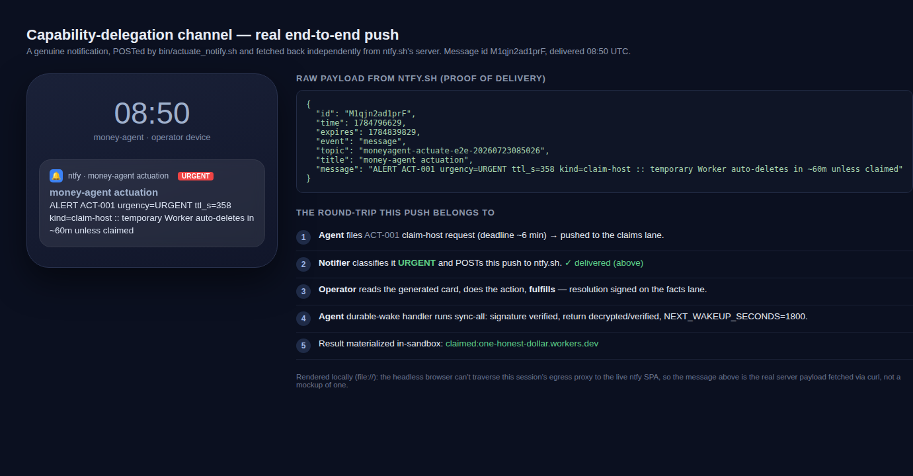

# Actuation channel — real end-to-end evidence

This is the Tier-L-adjacent evidence for the capability-delegation queue: a **real** notification
delivered through a live service, and the full round-trip transcript. It complements the
[acceptance harness](../acceptance_actuation.py) (21 offline checks) with proof against real
components. The only thing simulated is one process driving both lanes — the true two-machine /
human split is the operator gate that stays with the operator by design.

## The real push (delivered, independently re-fetched)

`bin/actuate_notify.sh` POSTed an URGENT alert for a `claim-host` request to ntfy.sh; the payload
below was fetched back **independently from ntfy's server** (`GET /<topic>/json`), so it is the
genuine delivered message, not a mock:

```json
{"id":"M1qjn2ad1prF","time":1784796629,"topic":"moneyagent-actuate-e2e-20260723085026",
 "title":"money-agent actuation",
 "message":"ALERT ACT-001 urgency=URGENT ttl_s=358 kind=claim-host :: temporary Worker auto-deletes in ~60m unless claimed"}
```



> The image is rendered locally (`file://`) because this session's egress proxy resets the headless
> browser for any live site — but the notification content shown is the real server-delivered
> payload above, fetched via curl.

## The full round-trip transcript

Agent files an URGENT `claim-host` request → notifier fires a real push → operator reads the
generated card and fulfills (signed on the facts lane) → the durable-wake handler runs `sync-all`,
verifies the signature, materializes the return, and emits the next wakeup. Note the card carries
the artifact `sha256` (verify-before-apply), and the materialized return is binary-safe
(base64 + sha256) — both from the adversarial-hardening pass.

```text
1. AGENT files a real URGENT claim-host request (deadline ~6 min out)
   bet-001 placed (approval clock). It now blocks any 'impossible' conclusion until resolved.
   id=ACT-001 requested (claim-host); return-kind=confirmation.

2. OPERATOR notifier fires -> REAL push to ntfy.sh
   actuate_notify: dispatched 1 new alert(s)

3. OPERATOR reads the card (what to do) and fulfills
   # Actuation task ACT-001 — claim-host
   **What/gate:** temporary Worker auto-deletes in ~60m unless claimed
   **Act as:** operator's Cloudflare account
   **Deadline:** 2026-07-23T08:56:28Z
   **Target URL:** https://dash.cloudflare.com/claim/abc123
   ## Steps
   1. Open the claim URL in a browser.
   2. Sign in to the Cloudflare account.
   3. Click "Claim" and confirm the host is yours.
   **Expected result:** host claimed and serving HTTP 200
   **Staged artifact (apply this):** run/actuation_artifacts/ACT-001/worker.js
       sha256: e8d113572614c869b33dfbcbfb22f4b98ad0102ae4696aa4a20e811af1d97ca9  (verify before applying)
   ## To fulfill (operator, from the facts lane)
       bin/actuate.py fulfill ACT-001 --minutes <n> --evidence "<what you did>"
   ACT-001 fulfilled on the verifier facts lane (4.0 human-minutes).

4. AGENT durable-wake handler fires -> sync-all + next wakeup
   ACT-001 synced from verifier facts: fulfilled -> run/actuation_returns/ACT-001.json.
   sync-all: 1 of 1 open task(s) synced
   NEXT_WAKEUP_SECONDS=1800

5. VERIFY the agent recovered the operator's result in-sandbox
   {
     "id": "ACT-001",
     "return_kind": "confirmation",
     "sha256": "eeb9f329c323711c4f1765022a3758277f72cfadf127fd67b2471d41c21c10e8",
     "return_value_b64": "Y2xhaW1lZDpvbmUtaG9uZXN0LWRvbGxhci53b3JrZXJzLmRldg==",
     "return_value": "claimed:one-honest-dollar.workers.dev"
   }

REAL E2E OK — push delivered, resolution signed+verified, return materialized.
```

## Reproduce it

The offline proof is `python3 tests/acceptance_actuation.py` (21 checks). The real-push leg needs an
outbound path to a notification service: set `ACTUATE_NTFY_TOPIC` and run the notifier against a
two-lane world (the driver used here is not committed — it composes `bin/actuate.py`,
`bin/actuate_notify.sh`, and `bin/actuate_watch.sh` exactly as production would).
